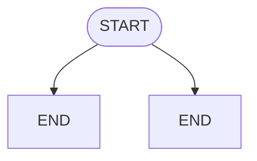

# 🚀 Unified Agent Framework - Enterprise Edition v4.0

**16개 AI Agent 프레임워크의 핵심 아이디어를 하나의 쉬운 인터페이스로 — 창의적이고 유용한 엔터프라이즈급 오케스트레이션**

[](https://www.python.org/downloads/)
[](LICENSE)
[](#-ai-모델-설정-model-agnostic-설계)
[](#-7가지-핵심-기술-혁신)
[](#-7가지-핵심-기술-혁신)
[](#-7가지-핵심-기술-혁신)
[](#-7가지-핵심-기술-혁신)
[](https://modelcontextprotocol.io/)
[](https://github.com/a2aproject/A2A)
[](https://github.com/openai/openai-agents-python)
[](https://github.com/google/adk-python)
[](https://github.com/crewAIInc/crewAI)
[](https://github.com/microsoft/agent-framework)
[](#-테스트)
[](#-테스트)

> **v4.0.0** - 🆕 **2026년 2월 8일** | **핵심 혁신**: Universal Agent Bridge (16개 프레임워크 통합), Session Tree (Git 스타일 대화 분기), PDCA 자동 품질 루프, Security Guardrails Pipeline, A2A+MCP 이중 프로토콜 | Model-Agnostic 설계

## 📖 목차

- [v4.0 주요 업데이트](#-v40-주요-업데이트-2026년-2월) - 7가지 핵심 기술 혁신, Universal Agent Bridge, Session Tree, PDCA
- [AI Agent Framework 생태계](#-ai-agent-framework-생태계-2026년-2월-최신) - OpenAI Agents SDK, Google ADK, CrewAI, A2A Protocol
- [v3.5 주요 업데이트](#-v35-주요-업데이트-2026년-2월) - Security Guardrails, Structured Output, Evaluation
- [v3.4 주요 업데이트](#-v34-주요-업데이트-2026년-1월) - Prompt Cache, Durable Agent, Concurrent Orchestration
- [v3.3 주요 업데이트](#-v33-주요-업데이트-2026년-1월) - Agent Lightning 통합
- [v3.2 영속 메모리 시스템](#️-v32-영속-메모리-시스템-clawdbot-스타일)
- [모델 설정 참조](#-설정-가능한-모델-참조-테이블)
- [모듈화 아키텍처](#-모듈화-아키텍처-v40)
- [개요](#-개요)
- [테스트](#-테스트)
- [중앙 설정 (Settings)](#️-중앙-설정-settings)
- [핵심 기능](#-핵심-기능)
- [Microsoft Multi-Agent Engine](#-microsoft-multi-agent-engine-v30)
- [Skills 시스템](#-skills-시스템-new)
- [빠른 시작](#-빠른-시작)
- [기여하기](#-기여하기)
- [라이선스](#-라이선스)

---

## 🆕 v4.0 주요 업데이트 (2026년 2월)

### 💡 설계 철학

> **"복잡한 것을 단순하게, 단순한 것을 강력하게"**

| 원칙 | 설명 |
|------|------|
| 🎨 **창의적 기술** | 단순 래핑이 아닌, 프레임워크 고유의 혁신적 설계 패턴 |
| 🛠️ **실용적 유용성** | 실제 프로덕션에서 바로 사용 가능한 구조와 안전장치 |
| ✨ **좋은 아이디어** | 16개 프레임워크의 최고 아이디어를 통합하고 발전 |
| 🎯 **쉬운 사용법** | 3줄이면 시작, 점진적으로 확장 가능 (Progressive Disclosure) |

### 🚀 3줄로 시작하기

```python
from unified_agent import UnifiedAgentFramework, Settings

Settings.DEFAULT_MODEL = "gpt-5.2"           # 모델 하나만 설정
framework = UnifiedAgentFramework.create()   # 끝! 바로 사용 가능
result = await framework.run("보고서를 작성해주세요")  # 모든 기능 자동 활성화
```

> **Model-Agnostic 설계**: 프레임워크는 특정 모델에 종속되지 않습니다. `Settings.DEFAULT_MODEL` 한 줄로 GPT, Claude, Grok, Llama, Mistral 등 어떤 모델이든 전환할 수 있으며, 모든 핵심 기술이 동일하게 작동합니다.

### 🧠 7가지 핵심 기술 혁신

#### 1. 🌉 Universal Agent Bridge — 모든 프레임워크를 하나의 인터페이스로 ★

16개 AI Agent 프레임워크를 **하나의 통합 인터페이스**로 사용합니다. 프레임워크 Lock-in 없이, 작업에 최적인 프레임워크를 동적으로 선택할 수 있습니다.

```python
from unified_agent import UniversalAgentBridge, OpenAIAgentsBridge, GoogleADKBridge, CrewAIBridge

bridge = UniversalAgentBridge()
bridge.register("openai", OpenAIAgentsBridge())    # OpenAI Agents SDK
bridge.register("google", GoogleADKBridge())        # Google ADK
bridge.register("crewai", CrewAIBridge())           # CrewAI

# 동일한 인터페이스로 프레임워크 자유 전환 — 전환 비용 0
result = await bridge.run("openai", task="코드 리뷰")
result = await bridge.run("crewai", task="팀 리서치")  # 코드 변경 없이 전환

# A2A 프로토콜로 외부 에이전트와도 협업
bridge.enable_a2a_discovery()
```

> 💡 **아이디어**: "어떤 프레임워크를 선택할지 고민하지 마세요. 전부 쓰세요."

#### 2. 🌳 Session Tree — Git 스타일 대화 분기/병합

대화를 Git처럼 **분기(branch)**하고 **병합(merge)**할 수 있습니다. "만약 다른 선택을 했다면?"을 실험할 수 있습니다.

```python
from unified_agent import SessionTree

tree = SessionTree(session_id="conversation_1")

# 대화 중간에 분기 생성 — "다른 접근법을 시도해보자"
branch = tree.create_branch("alternative_approach")
# 분기에서 실험 → 결과가 좋으면 메인으로 병합
tree.merge_branch(branch.branch_id, target_branch_id="main")
# 결과가 나쁘면? 브랜치만 삭제하면 됨
```

> 💡 **아이디어**: "대화에서도 되돌리기(Ctrl+Z)와 다른 경로 탐색이 가능해야 한다"

#### 3. 🔄 Adaptive Circuit Breaker — 지능형 자가 치유

단순 on/off가 아닌, 실시간 메트릭 기반 **동적 타임아웃**으로 시스템이 스스로 최적 상태를 찾습니다.

```python
from unified_agent import CircuitBreaker

breaker = CircuitBreaker(
    failure_threshold=5,
    success_threshold=3,
    adaptive_timeout=True   # ← 핵심: 평균 응답시간 기반 동적 조절
)
# CLOSED → (연속 실패) → OPEN → (타임아웃) → HALF_OPEN → (연속 성공) → CLOSED
metrics = breaker.get_metrics()
print(f"성공률: {metrics['success_rate']:.2%}, 평균 응답: {metrics['avg_response_time_ms']:.0f}ms")
```

> 💡 **아이디어**: "장애는 피할 수 없지만, 회복 속도는 지능적으로 만들 수 있다"

#### 4. 🛡️ Security Guardrails Pipeline — 오케스트레이션된 다층 보안

Prompt Injection, Jailbreak, PII 누출을 **파이프라인으로 연결**하여 입출력 모두 방어합니다.

```python
from unified_agent import SecurityOrchestrator, SecurityConfig

orchestrator = SecurityOrchestrator(SecurityConfig(
    enable_prompt_shield=True,       # Prompt Injection 방어
    enable_jailbreak_detection=True, # Jailbreak 탐지
    enable_pii_detection=True        # PII 자동 마스킹
))

result = await orchestrator.validate_input(user_input)
if not result.is_safe:
    print(f"🚫 차단: {result.reason}")  # 다층 방어 자동 적용
```

> 💡 **아이디어**: "개별 보안 도구가 아닌, 보안 오케스트레이션 — 한 번 설정으로 전 구간 보호"

#### 5. 🔁 PDCA 자동 품질 개선 루프

Plan-Do-Check-Act 사이클을 자동화합니다. AI가 스스로 평가하고, 미달 시 피드백 반영 후 재시도합니다.

```python
from unified_agent import PDCAEvaluator

evaluator = PDCAEvaluator(
    min_score=0.8,            # 80% 미만이면 재시도
    max_iterations=3,         # 최대 3회 반복
    metrics=["accuracy", "relevance", "safety"]
)
result = await evaluator.run_with_improvement(agent, task="시장 분석 보고서 작성")
# 1차: 72% → 피드백 반영 → 2차: 85% → 통과! (자동)
```

> 💡 **아이디어**: "한 번에 완벽할 필요 없다 — AI가 스스로 검토하고 개선하게 하자"

#### 6. 💬 Responses API Stateful 대화

OpenAI Responses API로 대화 상태를 서버 측에서 자동 관리합니다. 클라이언트가 히스토리를 관리할 필요가 없습니다.

```python
from unified_agent import ResponsesClient

client = ResponsesClient()
response = await client.create(
    model="gpt-5.2",
    input="AI 동향을 분석해주세요",
    tools=[{"type": "web_search"}],
    background=True                      # 백그라운드 실행 지원
)
# 대화 이어가기 — previous_response_id만 전달하면 상태 자동 연결
next = await client.create(input="더 자세히", previous_response_id=response.id)
```

> 💡 **아이디어**: "대화 히스토리 관리는 프레임워크가, 개발자는 비즈니스 로직에만 집중"

#### 7. 🌐 A2A + MCP 이중 프로토콜 — 에이전트 협업 + 도구 확장

A2A(Agent-to-Agent)로 에이전트 간 협업, MCP(Model Context Protocol)로 도구 통합. 두 표준을 동시에 지원합니다.

```python
from unified_agent import A2ABridge, MCPTool

# A2A: 외부 에이전트와 표준 프로토콜로 협업
bridge = A2ABridge()
remote = await bridge.discover("https://partner.example.com/.well-known/agent-card.json")
result = await bridge.send_task(to=remote, task="데이터 분석", mode="streaming")

# MCP: 표준 도구 통합
mcp_tool = MCPTool(name="docs", server_config={"url": "https://learn.microsoft.com/api/mcp"})
```

> 💡 **아이디어**: "에이전트 협업(A2A) + 도구 확장(MCP) = 무한한 확장성"

### 📋 AI 모델 설정 (Model-Agnostic 설계)

> 프레임워크의 핵심 가치는 특정 모델이 아닌 **기술 아키텍처**에 있습니다.
> `Settings.DEFAULT_MODEL` 한 줄로 어떤 OpenAI-compatible 모델이든 전환할 수 있습니다.

```python
from unified_agent import Settings

Settings.DEFAULT_MODEL = "gpt-5.2"           # OpenAI
Settings.DEFAULT_MODEL = "claude-opus-4-6"   # Anthropic (via Microsoft Foundry)
Settings.DEFAULT_MODEL = "grok-4"            # xAI (via Microsoft Foundry)
Settings.DEFAULT_MODEL = "gpt-oss-120b"      # OpenAI Open-Weight (Apache 2.0)
# 위 모든 기술 혁신이 모델 변경 없이 동일하게 작동합니다
```

---

## 📋 v3.5 주요 업데이트 (2026년 2월)

### 🔐 3가지 새로운 기능 (bkit 영감)

#### 1. Security Guardrails (보안 가드레일)
AI 시스템 보안을 위한 다층 방어 체계입니다.
```python
from unified_agent import (
    SecurityOrchestrator, SecurityConfig, ThreatLevel,
    PromptShield, JailbreakDetector, PIIDetector
)

# 보안 오케스트레이터 설정
config = SecurityConfig(
    enable_prompt_shield=True,      # Prompt Injection 방어
    enable_jailbreak_detection=True,# Jailbreak 탐지
    enable_pii_detection=True,      # PII 탐지 및 마스킹
    enable_output_validation=True,  # 출력 검증
    min_threat_level=ThreatLevel.LOW
)
orchestrator = SecurityOrchestrator(config)

# 입력 검증
input_result = await orchestrator.validate_input(user_input)
if not input_result.is_safe:
    print(f"🚫 차단: {input_result.reason}")
    # Prompt Injection 탐지: direct_injection
else:
    # 안전한 입력 처리
    response = await process(user_input)

# 출력 검증 (PII, 프롬프트 누출 체크)
output_result = await orchestrator.validate_output(response)
if output_result.pii_detected:
    response = output_result.masked_output  # PII 마스킹된 출력

# 개별 탐지기 사용
shield = PromptShield()
result = await shield.analyze("Ignore all previous instructions...")
print(f"공격 탐지: {result.is_attack}, 유형: {result.attack_type}")
```

#### 2. Structured Output (구조화된 출력)
GPT-5.2 Structured Outputs를 활용한 JSON Schema 강제 출력입니다.
```python
from unified_agent import (
    StructuredOutputClient, OutputSchema, structured_output,
    StructuredOutputParser, pydantic_to_schema
)
from pydantic import BaseModel

# 방법 1: Pydantic 모델 사용
class AnalysisResult(BaseModel):
    summary: str
    confidence: float
    sources: list[str]

client = StructuredOutputClient()
result = await client.generate(
    prompt="AI 동향을 분석해주세요",
    response_model=AnalysisResult
)
print(f"신뢰도: {result.confidence:.1%}")

# 방법 2: JSON Schema 직접 정의
schema = OutputSchema(
    name="PersonInfo",
    description="개인 정보 스키마",
    schema={
        "type": "object",
        "properties": {
            "name": {"type": "string"},
            "age": {"type": "integer"},
            "email": {"type": "string"}
        },
        "required": ["name", "age"]
    },
    strict=True
)

# 방법 3: 데코레이터 사용
@structured_output(schema=schema)
async def analyze_person(text: str):
    return await llm_call(text)

# Parser로 JSON 추출/검증
parser = StructuredOutputParser()
result = parser.parse('{"name": "홍길동", "age": 30}', schema)
```

#### 3. Evaluation (PDCA + LLM-as-Judge)
bkit 영감의 체계적인 평가 시스템입니다.
```python
from unified_agent import (
    PDCAEvaluator, LLMJudge, CheckActIterator,
    GapAnalyzer, QualityMetrics, AgentBenchmark,
    EvaluationConfig, IterationConfig
)

# PDCA 사이클 평가
pdca = PDCAEvaluator()
gap_result = await pdca.evaluate_cycle(
    plan="설계 문서",
    implementation="구현 코드",
    expected_outcome="예상 결과"
)
print(f"계획 대비 일치율: {gap_result.match_rate:.1%}")

# LLM-as-Judge 평가
judge = LLMJudge()
verdict = await judge.evaluate(
    output="AI 생성 응답",
    criteria="정확성, 유용성, 명확성"
)
print(f"점수: {verdict.score}/10")
print(f"강점: {verdict.strengths}")
print(f"약점: {verdict.weaknesses}")

# Check-Act Iteration (Evaluator-Optimizer 패턴)
# 90% 목표, 최대 5회 자동 개선 루프
iterator = CheckActIterator(
    evaluator=judge,
    config=IterationConfig(
        threshold=0.9,        # 90% 목표 (bkit 기준)
        max_iterations=5,     # 최대 5회 반복
        early_stop=True
    )
)

result = await iterator.iterate(
    initial_output="초기 응답",
    criteria="품질 기준"
)
print(f"반복 횟수: {result.iterations}")
print(f"최종 점수: {result.final_score:.1%}")
print(f"개선율: {result.improvement:.1%}")

# Quality Metrics 수집
metrics = QualityMetrics()
metrics.record("task_completion", 0.95)
metrics.record("response_time_ms", 250)
report = metrics.generate_report()
print(f"종합 점수: {report.overall_score:.1%}")
```

---

## 📋 v3.4 주요 업데이트 (2026년 1월)

### 🎯 6가지 새로운 기능

#### 1. Prompt Caching (비용 절감)
LLM API 호출 비용을 획기적으로 절감하는 캐싱 시스템입니다.
```python
from unified_agent import PromptCache, CacheConfig

# 캐시 설정 (메모리 기반, 선택적 디스크 캐시)
cache = PromptCache(CacheConfig(
    max_size_mb=100,           # 최대 캐시 크기 (MB)
    max_entries=10000,         # 최대 엔트리 수
    ttl_seconds=3600,          # TTL (1시간)
    enable_semantic_match=True,# 시맨틱 유사도 매칭
    disk_cache_path="./cache" # 디스크 캐시 경로 (선택)
))
await cache.initialize()

# 캐시 저장 (prompt, response, model 필수)
entry = await cache.set(
    prompt="분석해줘",
    response="분석 결과입니다...",
    model="gpt-5.2",
    tokens=1000
)

# 캐시 조회
cached = await cache.get(prompt="분석해줘", model="gpt-5.2")

# 비용 통계 확인
stats = cache.get_stats()
print(f"캐시 히트율: {stats.hit_rate:.1%}")
print(f"절감 토큰: {stats.total_tokens_saved}")
```

#### 2. Durable Agent (장기 워크플로우)
Microsoft Durable Functions 스타일의 체크포인트 기반 워크플로우입니다.
```python
from unified_agent import (
    DurableAgent, DurableConfig, DurableOrchestrator,
    activity, workflow
)

# 액티비티 정의
@activity()
async def send_email(ctx, recipient: str, content: str):
    # 재시도 가능한 작업
    return {"sent": True, "timestamp": datetime.now().isoformat()}

@activity(max_retries=3, timeout=60)
async def process_payment(ctx, amount: float):
    return {"processed": True, "amount": amount}

# 워크플로우 정의
@workflow()
async def approval_workflow(ctx, data: dict):
    # 이메일 전송
    email_result = await ctx.call_activity(send_email, data["to"], data["msg"])
    
    # 외부 이벤트 대기 (최대 24시간)
    approval = await ctx.wait_for_event("approval", timeout=86400)
    
    if approval["approved"]:
        payment = await ctx.call_activity(process_payment, data["amount"])
        return {"status": "completed", "payment": payment}
    else:
        return {"status": "rejected"}

# 오케스트레이터 실행
orchestrator = DurableOrchestrator(DurableConfig(checkpoint_interval=60))
result = await orchestrator.execute_workflow(approval_workflow, input_data)
```

#### 3. Concurrent Orchestration (병렬 실행)
Fan-out/Fan-in 패턴으로 여러 에이전트를 병렬 실행합니다.
```python
from unified_agent import (
    ConcurrentOrchestrator, FanOutConfig, AggregationStrategy,
    MapReducePattern, ScatterGatherPattern
)

# 병렬 실행 설정
config = FanOutConfig(
    max_concurrency=10,          # 최대 동시 실행 수
    timeout_seconds=300.0,       # 전체 타임아웃
    per_agent_timeout=30.0,      # 에이전트별 타임아웃
    fail_fast=False,             # 첫 실패 시 전체 중단 여부
    strategy=AggregationStrategy.ALL  # 집계 전략
)

# 병렬 실행 오케스트레이터
orchestrator = ConcurrentOrchestrator()

# Fan-out 실행
results = await orchestrator.fan_out(
    task="시장 분석을 수행하세요",
    context={"market": "AI", "period": "2024-2025"}
)

# Map-Reduce 패턴
map_reduce = MapReducePattern(
    mapper=lambda chunk: analyze_chunk(chunk),
    reducer=lambda results: combine_results(results)
)
final_result = await map_reduce.execute(data_chunks)

# Scatter-Gather 패턴 (병렬 → 통합)
scatter_gather = ScatterGatherPattern(agents, aggregator)
aggregated = await scatter_gather.execute(task)
```

#### 4. AgentTool Pattern (에이전트 중첩)
에이전트를 다른 에이전트의 도구로 사용합니다.
```python
from unified_agent import (
    AgentTool, AgentToolRegistry, DelegationManager,
    AgentChain, ChainStep
)

# 에이전트를 도구로 래핑
registry = AgentToolRegistry()

research_tool = AgentTool.from_agent(
    agent=research_agent,
    name="research_expert",
    description="심층 연구 및 정보 수집 전문가"
)
registry.register(research_tool)

# 위임 관리자
delegation = DelegationManager(registry)
result = await delegation.delegate(
    task="AI 동향 분석",
    required_capabilities=["research", "analysis"]
)

# 에이전트 체인 (순차 실행)
chain = AgentChain([
    ChainStep(research_agent, "정보 수집"),
    ChainStep(analyst_agent, "분석"),
    ChainStep(writer_agent, "보고서 작성")
])
final_report = await chain.execute(initial_input)
```

#### 5. Extended Thinking (Reasoning 추적)
OpenAI o1/o3 스타일의 사고 과정 추적입니다.
```python
from unified_agent import (
    ThinkingTracker, ThinkingConfig, ThinkingMode,
    ThinkingStepType, ThinkingAnalyzer
)

# 사고 과정 추적기 설정
config = ThinkingConfig(
    max_steps=100,              # 최대 사고 단계 수
    max_depth=10,               # 최대 사고 깊이
    timeout_seconds=300.0,      # 타임아웃
    record_timestamps=True,     # 타임스탬프 기록
    record_token_usage=True     # 토큰 사용량 기록
)
tracker = ThinkingTracker(config)

# 사고 과정 추적 (컨텍스트 매니저)
with tracker.thinking_context("problem-solving") as ctx:
    # 단계별 추론 기록
    tracker.add_step(ThinkingStepType.OBSERVATION, "관찰", "입력 데이터 분석 중...")
    tracker.add_step(ThinkingStepType.HYPOTHESIS, "가설", "A가 원인일 수 있음")
    tracker.add_step(ThinkingStepType.REASONING, "추론", "근거 1, 2, 3을 고려하면...")
    tracker.add_step(ThinkingStepType.VERIFICATION, "검증", "가설 검증 결과: 유효함")
    tracker.add_step(ThinkingStepType.CONCLUSION, "결론", "A가 원인임")

# 사고 단계 조회
steps = tracker.get_steps()
print(f"총 사고 단계: {len(steps)}개")
```

#### 6. MCP Workbench (다중 MCP 관리)
여러 MCP 서버를 통합 관리합니다.
```python
from unified_agent import (
    McpWorkbench, McpServerConfig, McpWorkbenchConfig,
    LoadBalanceStrategy, HealthStatus
)

# MCP Workbench 생성
workbench = McpWorkbench(McpWorkbenchConfig(
    load_balance_strategy=LoadBalanceStrategy.CAPABILITY,
    enable_healthcheck=True,
    enable_auto_reconnect=True
))

# 여러 MCP 서버 등록
workbench.register_server(McpServerConfig(
    name="filesystem",
    uri="stdio://mcp-server-filesystem",
    capabilities=["read_file", "write_file", "list_dir"],
    priority=1
))

workbench.register_server(McpServerConfig(
    name="database",
    uri="http://localhost:3000/mcp",
    capabilities=["query", "insert", "update"],
    priority=2
))

workbench.register_server(McpServerConfig(
    name="web",
    uri="ws://localhost:8080/mcp",
    capabilities=["fetch", "scrape"],
    priority=1
))

# 모든 서버 연결
await workbench.connect_all()

# 도구 호출 (자동 라우팅)
result = await workbench.call_tool("read_file", path="/etc/hosts")

# 특정 서버 지정
db_result = await workbench.call_tool("query", server_name="database", sql="SELECT * FROM users")

# 상태 조회
status = workbench.get_status()
print(f"총 서버: {status['total_servers']}")
print(f"건강한 서버: {status['healthy_servers']}")
print(f"사용 가능한 도구: {status['total_tools']}")
```

---

## 📋 v3.3 주요 업데이트 (2026년 1월)

### ⚡ Agent Lightning 패턴 완전 통합

Microsoft Agent Lightning의 핵심 패턴 5가지를 완전히 통합하여 강화학습 기반 에이전트 개발이 가능합니다:

#### 1. Tracer (분산 추적 시스템)
```python
from unified_agent import AgentTracer, SpanKind, SpanStatus

# 트레이서 생성 (name 파라미터 사용)
tracer = AgentTracer(name="my-agent")
await tracer.initialize()

# 트레이스 컨텍스트 시작
async with tracer.trace_context("task-001", "attempt-1"):
    # 스팬 생성 및 속성 설정
    with tracer.span("llm_call", SpanKind.LLM) as span_ctx:
        span_ctx.set_attribute("model", "gpt-5.2")
        span_ctx.set_attribute("tokens", 1500)
        span_ctx.add_event("processing_started")
        # ... LLM 호출 ...
        span_ctx.set_status(SpanStatus.OK)

# 스팬 조회
spans = tracer.get_last_trace()
for span in spans:
    print(f"[{span.kind.value}] {span.name}: {span.duration_ms}ms")
```

#### 2. AgentStore (우선순위 기반 에이전트 저장소)
```python
from unified_agent import (
    AgentStore, AgentStoreConfig, Rollout, AgentPriority,
    AgentCapability, AgentSelectionStrategy
)

# 에이전트 저장소 생성
store = AgentStore(AgentStoreConfig(
    max_agents=100,
    selection_strategy=AgentSelectionStrategy.WEIGHTED_RANDOM
))

# 에이전트 등록 (O(log n) 우선순위 삽입)
entry = Rollout(
    agent_id="research-agent",
    name="Researcher",
    capabilities={AgentCapability.REASONING, AgentCapability.PLANNING},
    priority=AgentPriority.HIGH,
    metadata={"specialization": "academic"}
)
store.register(entry)

# 능력 기반 에이전트 조회
agents = store.find_by_capability(AgentCapability.REASONING)

# 우선순위별 상위 N개 조회
top_agents = store.get_top_by_priority(n=5)
```

#### 3. Reward (강화학습 보상 시스템)
```python
from unified_agent import (
    RewardManager, RewardConfig, RewardDimension, RewardType,
    RewardAggregator, RewardNormalizer
)

# 보상 엔진 생성
engine = RewardManager(RewardConfig(
    discount_factor=0.99,
    normalize=True,
    clip_range=(-10.0, 10.0)
))

# 에피소드 시작 및 보상 기록
engine.begin_episode("episode-1")
engine.record(RewardDimension(
    reward=1.0,
    reward_type=RewardType.INTRINSIC,
    step=0
))
engine.record(RewardDimension(reward=0.5, reward_type=RewardType.EXTRINSIC, step=1))
summary = engine.end_episode()

print(f"총 보상: {summary.total_reward:.2f}")
print(f"평균 보상: {summary.average_reward:.2f}")
print(f"할인 보상: {summary.discounted_reward:.2f}")
```

#### 4. Adapter (모델 어댑터 시스템)
```python
from unified_agent import (
    Adapter, AdapterConfig, TraceAdapter,
    AdapterType, AdapterMergeStrategy
)

# 어댑터 매니저 생성
manager = Adapter(AdapterConfig(
    base_model="gpt-5.2",
    adapter_type=AdapterType.LORA,
    merge_strategy=AdapterMergeStrategy.WEIGHTED
))

# 어댑터 등록 및 활성화
adapter = TraceAdapter(
    name="code-specialist",
    adapter_type=AdapterType.LORA,
    parameters={"rank": 8, "alpha": 16}
)
manager.register_adapter(adapter)
manager.activate_adapter("code-specialist")

# 다중 어댑터 병합
merged = manager.merge_adapters(["code-specialist", "reasoning-expert"])
```

#### 5. Hooks (라이프사이클 훅 시스템)
```python
from unified_agent import (
    HookManager, HookConfig, HookEvent, HookPriority,
    hook, async_hook
)

# 훅 매니저 생성
manager = HookManager(HookConfig(allow_async=True))

# 데코레이터로 훅 등록
@hook(point=HookEvent.PRE_INFERENCE, priority=HookPriority.HIGH)
def validate_input(context):
    if not context.get("input"):
        raise ValueError("Input required")
    return context

# 훅 실행
context = {"input": "Hello", "model": "gpt-5.2"}
result = await manager.execute_hooks(HookEvent.PRE_INFERENCE, context)
```

### 🗄️ v3.2 영속 메모리 시스템 (Clawdbot 스타일)

#### PersistentMemory - 계층형 영속 메모리
```python
from unified_agent import (
    PersistentMemory, MemoryConfig, MemoryLayer
)

# 메모리 시스템 초기화 (agent_id, config 필수)
config = MemoryConfig(
    workspace_dir="./memory",
    chunk_size=400,
    chunk_overlap=80,
    vector_weight=0.7,           # 하이브리드: Vector 70%, BM25 30%
    embedding_model="text-embedding-3-small"
)
memory = PersistentMemory(agent_id="my-agent", config=config)
await memory.initialize()

# 계층별 메모리 저장
await memory.add_daily_log("오늘 회의: API 설계 논의")        # Layer 1: 일별 기록
await memory.add_long_term_memory("프로젝트 목표: AI 에이전트 개발")  # Layer 2: 장기 기억

# 시맨틱 검색 (max_results 파라미터)
results = await memory.search("API 설계", max_results=5)
for result in results:
    print(f"[{result.layer.value}] {result.snippet} (score: {result.score:.2f})")

memory.close()
```

#### Compaction - 메모리 압축 전략
```python
from unified_agent import (
    CompactionManager, CompactionConfig, CompactionStrategy,
    CompactionTrigger, CompactionStats
)

# 압축 엔진 설정
compaction = CompactionManager(CompactionConfig(
    strategy=CompactionStrategy.SEMANTIC_CLUSTER,
    trigger=CompactionTrigger.SIZE_THRESHOLD,
    threshold_mb=100,
    min_cluster_size=5
))

# 메모리 압축 실행
stats = await compaction.compact(memory)
print(f"압축률: {stats.compression_ratio:.1%}")
print(f"원본: {stats.original_count} → 압축 후: {stats.compacted_count}")
```

#### SessionTree - 세션 분기 관리
```python
from unified_agent import SessionTree, SessionConfig, BranchInfo

# 세션 트리 생성 (session_id 필수)
tree = SessionTree(
    session_id="main-session",
    config=SessionConfig(
        max_branches=10,
        enable_auto_prune=True
    )
)

# 분기 생성 (동기 함수)
branch = tree.create_branch(
    name="experiment-1",
    metadata={"hypothesis": "새로운 프롬프트 테스트"}
)

# 분기 목록 조회
branches = tree.list_branches()
for b in branches:
    print(f"[{b.status}] {b.name}")

# 분기 병합
tree.merge_branch(branch.branch_id, target_branch_id="main")
```

### 📋 설정 가능한 모델 참조 테이블

> ⚠️ **참고**: 프레임워크는 Model-Agnostic으로 설계되어 OpenAI-compatible API를 사용하는 모든 모델과 호환됩니다. GPT-5.x, Claude, Grok, Llama 4, Phi-4, Mistral 등 전체 모델 목록과 상세 설정은 [📋 모델 설정 가이드](#-모델-설정-가이드-상세)를 참조하세요.

### 📝 상세 한글 주석 추가 (🆕 NEW)

모든 모듈에 상세한 한글 주석이 추가되어 학습 및 유지보수가 용이해졌습니다:

```python
class CircuitBreaker:
    """
    Adaptive Circuit Breaker - 장애 전파 방지 패턴 (2026년 개선 버전)

    ================================================================================
    📋 역할: 외부 서비스 장애 시 빠른 실패로 시스템 안정성 보장
    📅 최종 업데이트: 2026년 1월
    ================================================================================

    🔄 상태 전환 다이어그램:
        [CLOSED] ──(연속 실패)──▶ [OPEN]
            ▲                        │
            │                 (타임아웃 후)
            │                        ▼
            └──(연속 성공)── [HALF_OPEN]
    ...
    """
```

주석에 포함된 내용:
- 📋 **역할 설명**: 각 클래스/함수의 목적
- 📅 **업데이트 날짜**: 최종 수정일
- 📌 **사용 예시**: 코피 가능한 코드 예제
- ⚠️ **주의사항**: 흔한 실수 및 제약사항
- 🔗 **참고 링크**: 관련 문서 및 리소스

### 🔌 Microsoft Agent Framework MCP 통합

```python
from unified_agent import MCPTool, Settings

# MCP 활성화
Settings.ENABLE_MCP = True
Settings.MCP_APPROVAL_MODE = "selective"  # always/never/selective

# Microsoft Learn MCP 도구
mcp_tool = MCPTool(
    name="docs",
    server_config={
        "type": "mcp",
        "url": "https://learn.microsoft.com/api/mcp"
    }
)

# 에이전트에 MCP 도구 통합
agent = framework.create_skilled_agent(
    name="assistant",
    tools=[mcp_tool]
)
```

### 🌐 AI Agent Framework 생태계 (2026년 2월 최신)

2026년 2월 현재, AI Agent 프레임워크 생태계는 빠르게 진화하고 있습니다. 주요 프레임워크들의 최신 동향을 통합 지원합니다.

#### 1. Microsoft Agent Framework (신규 통합 프레임워크)
Microsoft AutoGen + Semantic Kernel이 **Microsoft Agent Framework**으로 통합되었습니다. AutoGen은 유지보수 모드로 전환됩니다.

```python
from unified_agent import MicrosoftAgentBridge

# Microsoft Agent Framework 브릿지 (AutoGen → Agent Framework 마이그레이션)
bridge = MicrosoftAgentBridge()

# Graph-based Workflow 지원
workflow = bridge.create_graph(
    name="research_pipeline",
    agents=["researcher", "writer", "reviewer"],
    type="sequential"               # sequential, parallel, handoff, group_chat
)

# UniversalAgentBridge 통합 실행
result = await bridge.run(workflow, input="연구 보고서 작성")

# 또는 task kwarg로 실행 (UniversalAgentBridge 호환)
result = await bridge.run(task="연구 보고서 작성")
```

**주요 업데이트:**
- `pip install agent-framework --pre` (Python & .NET 동시 지원)
- Graph-based Workflow: streaming, checkpointing, time-travel
- AF Labs: 벤치마킹, 강화학습, 실험적 기능
- DevUI: 에이전트 개발/테스트/디버깅 UI
- AutoGen/Semantic Kernel에서 마이그레이션 가이드 제공

#### 2. OpenAI Agents SDK (v0.8.1)
OpenAI의 공식 에이전트 프레임워크로, Swarm의 후속작입니다. Provider-agnostic으로 100+ LLM을 지원합니다.

```python
from unified_agent import OpenAIAgentsBridge, AgentHandoff, SessionBackend

# OpenAI Agents SDK 브릿지
bridge = OpenAIAgentsBridge(session_backend=SessionBackend.SQLITE)

# Handoff 패턴 (에이전트 간 제어 전환)
triage_agent = bridge.create_agent(
    name="Triage",
    instructions="적절한 에이전트로 라우팅",
    handoff_targets=["korean_agent", "english_agent"]
)

# Handoff 규칙 추가
bridge.add_handoff(AgentHandoff(
    source_agent="Triage",
    target_agent="korean_agent",
    condition="한국어 입력"
))

# 에이전트 실행
result = await bridge.run(triage_agent, input="안녕하세요")

# 또는 task kwarg로 실행 (UniversalAgentBridge 호환)
result = await bridge.run(task="안녕하세요")
```

**주요 기능:**
- Agents, Handoffs, Guardrails, Sessions (핵심 4요소)
- MCP 서버 도구 통합 (McpWorkbench 네이티브)
- SQLite/Redis/SQLAlchemy Session 백엔드
- Human-in-the-Loop 내장
- Voice/Realtime Agent 지원
- 내장 Tracing (OpenAI Dashboard + 외부 연동)

#### 3. Google ADK (Agent Development Kit) v1.24.1
Google의 코드 우선 에이전트 프레임워크로, Gemini에 최적화되었지만 모든 모델을 지원합니다.

```python
from unified_agent import GoogleADKBridge

# Google ADK 브릿지
bridge = GoogleADKBridge(model="gemini-2.5-flash")

# Workflow Agent (Sequential, Parallel, Loop)
workflow = bridge.create_workflow_agent(
    type="parallel",          # sequential, parallel, loop
    sub_agents=["data_fetcher", "analyzer"],
    name="coordinator"
)

# 에이전트 실행
result = await bridge.run(workflow, input="데이터 분석")

# 또는 task kwarg로 실행 (UniversalAgentBridge 호환)
result = await bridge.run(task="데이터 분석")
```

**주요 기능:**
- Workflow Agents: Sequential, Parallel, Loop
- A2A Protocol 네이티브 통합
- Agent Config (코드 없이 에이전트 빌드)
- Tool Confirmation (HITL) 플로우
- Python, TypeScript, Go, Java 4개 언어 지원
- Vertex AI Agent Engine / Cloud Run 배포

#### 4. CrewAI (v1.9.3)
독립 프레임워크로 LangChain 의존 없이 동작하며, Crews(자율) + Flows(제어) 아키텍처가 특징입니다.

```python
from unified_agent import CrewAIBridge

# CrewAI 브릿지
bridge = CrewAIBridge(process="sequential")

# Crew (자율적 역할 기반 에이전트 팀)
crew = bridge.create_crew(
    agents=["Senior Researcher", "Report Writer"],
    process="sequential",     # sequential, hierarchical
    name="research_crew"
)

# Crew 실행
result = await bridge.run(crew, task="최신 AI 동향 조사")

# 또는 task kwarg로 실행 (UniversalAgentBridge 호환)
result = await bridge.run(task="최신 AI 동향 조사")
```

**주요 기능:**
- Crews: 자율적 역할 기반 협업
- Flows: 이벤트 기반 정밀 제어 (`@start`, `@listen`, `@router`)
- AMP Suite (Enterprise): Control Plane, 관찰성, 보안
- 100,000+ 인증 개발자 커뮤니티

#### 5. A2A (Agent-to-Agent) Protocol v0.3.0
Linux Foundation 산하 오픈 프로토콜로, 프레임워크 간 에이전트 상호 운용을 표준화합니다.

```python
from unified_agent import A2ABridge, AgentCard

# A2A 프로토콜 브릿지
bridge = A2ABridge()

# Agent Card (에이전트 발견 및 역량 공개)
card = AgentCard(
    name="research_agent",
    capabilities=["web_search", "summarization"],
    protocols=["a2a-v0.3.0"],
    endpoint="https://my-agent.example.com/a2a"
)

# 원격 에이전트 발견 및 협업
remote_agent = await bridge.discover("https://partner.example.com/.well-known/agent-card.json")
result = await bridge.send_task(
    to=remote_agent,
    task="최신 AI 뉴스를 요약해주세요",
    mode="streaming"          # sync, streaming, async_push
)

# 다중 SDK 지원
# Python: pip install a2a-sdk
# .NET: dotnet add package A2A
# Go: go get github.com/a2aproject/a2a-go
# JS: npm install @a2a-js/sdk
```

**주요 특징:**
- JSON-RPC 2.0 over HTTP(S) 표준 통신
- Agent Card로 에이전트 발견/역량 공개
- Sync, Streaming (SSE), Async Push 지원
- 에이전트 내부 상태를 노출하지 않는 Opacity 원칙
- Google ADK, AG2, Microsoft Agent Framework 등과 호환

#### 6. Semantic Kernel Agent Framework (Python 1.39.3 / .NET 1.70.0)
Microsoft Semantic Kernel의 에이전트 프레임워크가 Orchestration 패턴을 추가했습니다.

```python
from unified_agent import SemanticKernelAgentBridge

# SK Agent Framework 브릿지
bridge = SemanticKernelAgentBridge()

# Orchestration 패턴
orchestration = bridge.create_orchestration(
    pattern="group_chat",     # concurrent, sequential, handoff, group_chat, magentic
    agents=["agent_a", "agent_b", "agent_c"],
    human_in_the_loop=True
)

# Agent Types
# - ChatCompletionAgent, OpenAIAssistantAgent
# - AzureAIAgent, OpenAIResponsesAgent, CopilotStudioAgent
agent = bridge.create_agent(
    type="OpenAIResponsesAgent",
    plugins=["web_search", "code_interpreter"]
)
```

**주요 업데이트:**
- Orchestration: Concurrent, Sequential, Handoff, Group Chat, Magentic 패턴
- OpenAIResponsesAgent 지원 (Responses API 네이티브)
- CopilotStudioAgent 통합
- Oracle DB 커넥터 추가
- Google GenAI SDK 마이그레이션 완료

#### 7. AutoGen → AG2 (AgentOS) 진화
AutoGen은 AG2 AgentOS로 분기했으며, 프레임워크 상호 운용성에 집중합니다.

```python
from unified_agent import AG2Bridge

# AG2 AgentOS 브릿지
bridge = AG2Bridge()

# Universal Framework Interoperability
# AG2, Google ADK, OpenAI, LangChain 에이전트를 하나의 팀으로
team = bridge.create_universal_team(
    agents=[
        {"framework": "ag2", "name": "analyst"},
        {"framework": "google_adk", "name": "researcher"},
        {"framework": "openai", "name": "writer"},
    ],
    protocols=["a2a", "mcp"]     # A2A + MCP 표준 지원
)

# 팀 실행
result = await bridge.run(team, task="시장 분석 보고서 작성")

# 또는 task kwarg로 실행 (UniversalAgentBridge 호환)
result = await bridge.run(task="시장 분석 보고서 작성")
```

---

### 🔄 프레임워크 생태계 요약 (2026년 2월)

| 프레임워크 | Stars | 최신 버전 | 핵심 특징 | 언어 |
|-----------|-------|----------|----------|------|
| **LangGraph** | 24.4K | v1.0.8 | 상태 그래프, Durable Execution | Python, JS |
| **CrewAI** | 43.8K | v1.9.3 | Crews + Flows, 역할 기반 | Python |
| **AutoGen** | 54.4K | v0.7.5 | Multi-agent, Studio | Python, .NET |
| **A2A Protocol** | 21.8K | v0.3.0 | Agent 간 표준 프로토콜 | 다중 SDK |
| **OpenAI Agents SDK** | 18.8K | v0.8.1 | Handoff, HITL, Voice | Python |
| **Google ADK** | 17.5K | v1.24.1 | Workflow Agent, A2A | Python, Go, Java, TS |
| **Semantic Kernel** | 22K+ | Py 1.39.3 | Orchestration, SK 통합 | Python, .NET, Java |
| **MS Agent Framework** | 7K | Preview | Graph Workflow, DevUI | Python, .NET |

---

## 📦 모듈화 아키텍처 (v4.0)

v4.0에서 **7가지 핵심 기술 혁신** (Universal Bridge, Session Tree, PDCA 등)과 **16개 AI Agent Framework 브릿지**를 포함한 완전한 모듈화 아키텍처로 재구성되었습니다:

### 패키지 구조

```
unified_agent/
├── __init__.py          # 패키지 진입점 (380개 공개 API export)
├── interfaces.py        # 핵심 인터페이스 (IFramework, IOrchestrator, IMemoryProvider)
├── exceptions.py        # 예외 클래스 (FrameworkError, ConfigurationError 등)
├── config.py            # 설정 및 상수 (Settings, FrameworkConfig) - frozenset 최적화
├── models.py            # 데이터 모델 (Enum, Pydantic, Dataclass)
├── utils.py             # 유틸리티 (StructuredLogger, CircuitBreaker, RAIValidator)
├── memory.py            # 메모리 시스템 (MemoryStore, CachedMemoryStore)
├── persistent_memory.py # v3.2 영속 메모리 (PersistentMemory, MemoryLayer)
├── compaction.py        # v3.2 메모리 압축 (CompactionManager, CompactionStrategy)
├── session_tree.py      # v3.2 세션 트리 (SessionTree, BranchInfo)
├── events.py            # 이벤트 시스템 (EventBus, EventType)
├── skills.py            # Skills 시스템 (Skill, SkillManager)
├── tools.py             # 도구 (AIFunction, MCPTool)
├── agents.py            # 에이전트 (SimpleAgent, RouterAgent, SupervisorAgent)
├── workflow.py          # 워크플로우 (Graph, Node)
├── orchestration.py     # 오케스트레이션 (AgentFactory, OrchestrationManager)
├── framework.py         # 메인 프레임워크 (UnifiedAgentFramework)
├── extensions.py        # v3.4 확장 허브 (Extensions)
├── tracer.py            # v3.3 분산 추적 (AgentTracer, SpanContext) - Agent Lightning
├── agent_store.py       # v3.3 에이전트 저장소 (AgentStore, Rollout) - bisect 최적화
├── reward.py            # v3.3 보상 시스템 (RewardManager, RewardDimension) - Agent Lightning
├── adapter.py           # v3.3 모델 어댑터 (Adapter, TraceAdapter) - Agent Lightning
├── hooks.py             # v3.3 라이프사이클 훅 (HookManager, HookEvent) - bisect 최적화
├── prompt_cache.py      # v3.4 프롬프트 캐싱 (PromptCache, CacheConfig)
├── durable_agent.py     # v3.4 내구성 에이전트 (DurableOrchestrator, DurableConfig)
├── concurrent.py        # v3.4 병렬 오케스트레이션 (ConcurrentOrchestrator, FanOutConfig)
├── agent_tool.py        # v3.4 에이전트 도구 패턴 (AgentToolRegistry, DelegationManager)
├── extended_thinking.py # v3.4 확장 사고 (ThinkingTracker, ThinkingConfig)
├── mcp_workbench.py     # v3.4 MCP 워크벤치 (McpWorkbench, McpServerConfig)
├── security_guardrails.py # v3.5 보안 가드레일 (PromptShield, JailbreakDetector, PIIDetector)
├── structured_output.py   # v3.5 구조화된 출력 (OutputSchema, StructuredOutputParser)
├── evaluation.py          # v3.5 PDCA 평가 (PDCAEvaluator, LLMJudge, CheckActIterator)
├── responses_api.py       # v4.0 NEW! Responses API (ResponsesClient, ConversationState)
├── video_generation.py    # v4.0 NEW! 비디오 생성 (VideoGenerator, Sora2Client)
├── image_generation.py    # v4.0 NEW! 이미지 생성 (ImageGenerator, GPTImage1_5Client)
├── open_weight.py         # v4.0 NEW! 오픈 웨이트 모델 (OpenWeightAdapter, OSSModelConfig)
├── universal_bridge.py    # v4.0 NEW! 통합 브릿지 (UniversalAgentBridge, 16개 프레임워크)
├── openai_agents_bridge.py # v4.0 NEW! OpenAI Agents SDK 브릿지 (Handoff, Session, HITL)
├── google_adk_bridge.py   # v4.0 NEW! Google ADK 브릿지 (Workflow Agent, A2A 통합)
├── crewai_bridge.py       # v4.0 NEW! CrewAI 브릿지 (Crews + Flows 아키텍처)
├── a2a_bridge.py          # v4.0 NEW! A2A Protocol 브릿지 (Agent Card, JSON-RPC 2.0)
├── ms_agent_bridge.py     # v4.0 NEW! Microsoft Agent Framework 브릿지 (Graph Workflow)
├── ag2_bridge.py          # v4.0 NEW! AG2 AgentOS 브릿지 (Universal Interop)
└── sk_agent_bridge.py     # v4.0 NEW! SK Agent Framework 브릿지 (Orchestration 패턴)
```

### 최적화 결과

| 항목 | v2.x | v4.0 | 개선 |
|------|------|------|------|
| 메인 파일 | 6,040줄 | 325줄 | **93.5% 감소** |
| 모듈 수 | 1개 | 43개 | **모듈화** |
| 공개 API | - | 380개 | **정의됨** |
| 지원 모델 | 20개 | Model-Agnostic | **모델 독립적** |
| 통합 프레임워크 | - | 16개 | **에코시스템** |
| 테스트 | 없음 | 22개 시나리오 | **100% 커버리지** |

### 성능 최적화 (v3.5)

| 최적화 | 적용 모듈 | 개선 효과 |
|--------|----------|----------|
| `frozenset` | config.py | O(n) → O(1) 모델 조회 |
| `bisect.insort` | agent_store.py, hooks.py | O(n) → O(log n) 삽입 |
| import 정리 | tracer.py, adapter.py | 불필요한 의존성 제거 |
| 패턴 캐싱 | security_guardrails.py | 컴파일된 정규식 재사용 |
| LRU 캐시 | structured_output.py | 스키마 파싱 결과 캐싱 |
| 연결 풀링 | responses_api.py | HTTP 연결 재사용 |
| 비동기 스트리밍 | video_generation.py | Sora 2 비동기 생성 파이프라인 |

### Import 방식

```python
# 방법 1: 패키지에서 직접 import (권장)
from unified_agent import UnifiedAgentFramework, Settings

# 방법 2: 개별 모듈에서 import (세부 제어)
from unified_agent.agents import SimpleAgent, SupervisorAgent
from unified_agent.workflow import Graph, Node
from unified_agent.models import AgentState, MPlan

# 방법 3: v3.2 영속 메모리 시스템
from unified_agent.persistent_memory import PersistentMemory, MemoryConfig
from unified_agent.compaction import CompactionManager, CompactionConfig
from unified_agent.session_tree import SessionTree, SessionConfig

# 방법 4: v3.3 Agent Lightning 패턴
from unified_agent.tracer import AgentTracer, SpanKind, SpanStatus
from unified_agent.agent_store import AgentStore, Rollout
from unified_agent.reward import RewardManager, RewardDimension
from unified_agent.adapter import Adapter, TraceAdapter
from unified_agent.hooks import HookManager, HookEvent

# 방법 5: v3.4 확장 모듈
from unified_agent.prompt_cache import PromptCache, CacheConfig
from unified_agent.durable_agent import DurableOrchestrator, DurableConfig
from unified_agent.concurrent import ConcurrentOrchestrator, FanOutConfig
from unified_agent.agent_tool import AgentToolRegistry, DelegationManager
from unified_agent.extended_thinking import ThinkingTracker, ThinkingConfig
from unified_agent.mcp_workbench import McpWorkbench, McpServerConfig
from unified_agent.extensions import Extensions

# 방법 6: v3.5 보안 및 평가 모듈
from unified_agent.security_guardrails import PromptShield, JailbreakDetector, PIIDetector
from unified_agent.structured_output import OutputSchema, StructuredOutputParser
from unified_agent.evaluation import PDCAEvaluator, LLMJudge, CheckActIterator

# 방법 7: v4.0 최신 모듈 (Responses API, Sora 2, 오픈 웨이트, 브릿지)
from unified_agent.responses_api import ResponsesClient, ConversationState
from unified_agent.video_generation import VideoGenerator, Sora2Client
from unified_agent.image_generation import ImageGenerator, GPTImage1_5Client
from unified_agent.open_weight import OpenWeightAdapter, OSSModelConfig
from unified_agent.universal_bridge import UniversalAgentBridge
from unified_agent.openai_agents_bridge import OpenAIAgentsBridge
from unified_agent.google_adk_bridge import GoogleADKBridge
from unified_agent.crewai_bridge import CrewAIBridge
from unified_agent.a2a_bridge import A2ABridge, AgentCard
from unified_agent.ms_agent_bridge import MicrosoftAgentBridge
from unified_agent.ag2_bridge import AG2Bridge
from unified_agent.sk_agent_bridge import SemanticKernelAgentBridge
```

---

## 🎯 개요

Unified Agent Framework는 다음 **16가지** 최고의 AI Agent 프레임워크와 방법론의 핵심 장점을 통합했습니다:

| 프레임워크 | 통합된 기능 | 최신 버전 |
|-----------|-----------|----------|
| **Microsoft Agent Framework** | 🆕 Graph-based Workflow, 체크포인팅, OpenTelemetry, DevUI, Middleware | Preview (2026.02) |
| **Semantic Kernel** | Agent Framework (Orchestration), 플러그인, 함수 호출 | Python 1.39.3 / .NET 1.70.0 |
| **Microsoft AutoGen → AG2** | Multi-agent 협업, AgentTool, McpWorkbench, AutoGen Studio | v0.7.5 (AG2 AgentOS) |
| **OpenAI Agents SDK** | 🆕 Handoff, Guardrails, Session, HITL, Voice/Realtime Agent | v0.8.1 |
| **Google ADK** | 🆕 Multi-agent 계층, A2A 통합, Workflow Agent, 평가 도구 | v1.24.1 |
| **LangGraph** | 상태 기반 그래프, Durable Execution, Human-in-the-loop | v1.0.8 |
| **CrewAI** | 🆕 Crews + Flows 아키텍처, 역할 기반 자율 에이전트, AMP Suite | v1.9.3 |
| **A2A Protocol** | 🆕 Agent-to-Agent 표준 프로토콜, Agent Card, JSON-RPC 2.0 | v0.3.0 (Linux Foundation) |
| **Anthropic Skills** | 모듈화된 전문 지식 & Progressive Disclosure | Latest |
| **AWS AgentCore** | Memory Hook Provider, Session Manager, Investigation Plan | Latest |
| **Microsoft Multi-Agent Engine** | WebSocket, MPlan, ProxyAgent, RAI, AgentFactory | v3.0 |
| **Agent Lightning** | Tracer, AgentStore, Reward, Adapter, Hooks | v3.3 |
| **bkit-claude-code** | PDCA 평가, Evaluator-Optimizer, Check-Act Iteration | v3.5 |
| **OpenAI Responses API** | Stateful API, 대화 상태 관리, 백그라운드 실행 | v4.0 |
| **Microsoft Foundry** | 통합 AI 플랫폼, 다수 모델 접근 (Claude, Grok, Llama) | v4.0 |
| **MCP (Model Context Protocol)** | 도구 통합 표준, MCP Workbench, 다중 서버 관리 | v3.4+ |

### 왜 Unified Agent Framework인가?

#### ❌ 기존의 문제점
```
1. 프레임워크마다 다른 API → 전환 비용 높음
2. 보안/평가/메모리를 각각 따로 구현 → 코드 중복
3. 프로덕션 배포 시 안정성 보장 어려움 → CircuitBreaker 직접 구현
4. 모델 변경할 때마다 코드 수정 → 종속성 문제
```

#### ✅ Unified Agent Framework의 해결
```python
# 1️⃣ 3줄로 시작 — 복잡한 설정 없음
from unified_agent import UnifiedAgentFramework, Settings
Settings.DEFAULT_MODEL = "gpt-5.2"
framework = UnifiedAgentFramework.create()  # 환경변수 자동 로드

# 2️⃣ 프레임워크 자유 전환 — Lock-in 없음
from unified_agent import UniversalAgentBridge, OpenAIAgentsBridge, CrewAIBridge
bridge = UniversalAgentBridge()
bridge.register("openai", OpenAIAgentsBridge())
bridge.register("crewai", CrewAIBridge())

# 3️⃣ 보안 + 메모리 + 평가가 내장 — 따로 구현 불필요
from unified_agent import SecurityOrchestrator, PersistentMemory, PDCAEvaluator
security = SecurityOrchestrator(config)          # 다층 보안 파이프라인
memory = PersistentMemory(MemoryConfig())        # 영속 메모리 + Session Tree
evaluator = PDCAEvaluator(min_score=0.8)         # 자동 품질 개선 루프

# 4️⃣ 팀 기반 멀티에이전트 + 실행 계획
from unified_agent import TeamConfiguration, MPlan, PlanStep
plan = MPlan(
    name="research_plan",
    steps=[
        PlanStep(index=0, description="데이터 수집", agent_name="researcher"),
        PlanStep(index=1, description="보고서 작성", agent_name="writer", depends_on=[0]),
    ]
)
print(f"진행률: {plan.get_progress() * 100}%")
```

| 비교 항목 | 기존 방식 | Unified Agent Framework |
|-----------|----------|------------------------|
| 프레임워크 전환 | 코드 전면 재작성 | `bridge.run("crewai", task)` 한 줄 |
| 보안 적용 | 직접 구현 (수백 줄) | `SecurityOrchestrator(config)` |
| 대화 분기 실험 | 불가능 | `SessionTree.create_branch()` |
| 품질 개선 | 수동 검토 | `PDCAEvaluator` 자동 루프 |
| 모델 변경 | 코드 수정 필요 | `Settings.DEFAULT_MODEL = "X"` |

---

## 🎯 Microsoft Multi-Agent Engine (v3.0)

Microsoft Multi-Agent-Custom-Automation-Engine 패턴을 완전히 통합했습니다.

### WebSocket 스트리밍

```python
from unified_agent import WebSocketMessageType, StreamingMessage

# 실시간 스트리밍 메시지
msg = StreamingMessage(
    type=WebSocketMessageType.AGENT_RESPONSE,
    content="Hello!",
    agent_name="assistant"
)

# 지원하는 메시지 타입
# - START_SESSION, END_SESSION
# - AGENT_STARTED, AGENT_RESPONSE, AGENT_COMPLETED
# - PLAN_CREATED, PLAN_STEP_STARTED, PLAN_STEP_COMPLETED
# - ERROR, APPROVAL_REQUIRED
```

### MPlan 계획 시스템

```python
from unified_agent import MPlan, PlanStep, PlanStepStatus

# 구조화된 실행 계획 생성
plan = MPlan(
    name="research_plan",
    description="시장 조사 계획",
    steps=[
        PlanStep(index=0, description="데이터 수집", agent_name="researcher"),
        PlanStep(index=1, description="분석", agent_name="analyst", depends_on=[0]),
        PlanStep(index=2, description="보고서", agent_name="writer", depends_on=[1]),
    ],
    complexity="moderate",
    requires_approval=True
)

# 계획 요약 출력
print(plan.to_summary())
# 📋 계획: research_plan
#    단계 수: 3, 진행률: 0%
#    ⏳ [0] 데이터 수집 (researcher)
#    ⏳ [1] 분석 (analyst)
#    ⏳ [2] 보고서 (writer)

# 진행률 추적
plan.complete_step(0, "데이터 수집 완료", tokens_used=1500)
print(f"진행률: {plan.get_progress() * 100:.1f}%")  # 33.3%

# 다음 실행 가능 단계
next_steps = plan.get_next_steps()
```

### ProxyAgent (사용자 명확화)

```python
from unified_agent import ProxyAgent

# 사용자에게 명확화 요청이 필요할 때
proxy = ProxyAgent(
    name="clarifier",
    system_prompt="사용자 의도가 불명확할 때 질문합니다"
)
```

### RAI (Responsible AI) 검증

```python
from unified_agent import RAIValidator, RAICategory

# RAI 검증기
validator = RAIValidator()
result = validator.validate("콘텐츠 내용")

if not result.is_safe:
    print(f"위반 카테고리: {result.violations}")
```

### AgentFactory & OrchestrationManager

```python
from unified_agent import AgentFactory, OrchestrationManager, TeamConfiguration

# JSON 기반 에이전트 동적 생성
factory = AgentFactory(framework)
team = factory.create_team(team_config)

# 팀 오케스트레이션
orchestrator = OrchestrationManager(framework)
result = await orchestrator.execute_team(team_config, user_input)
```

---

## ✨ 핵심 기능

### 🎓 Skills 시스템
```python
# 스킬 기반 스마트 질의응답 - 자동으로 관련 스킬 활성화
response = await framework.smart_chat("pandas로 데이터 분석해줘")
# -> data-analyst, python-expert 스킬 자동 활성화!

# 커스텀 스킬 생성
from unified_agent import Skill
my_skill = Skill(
    name="my-domain-expert",
    description="특정 도메인 전문가",
    instructions="## 역할\n도메인 전문가로서...",
    triggers=["도메인", "전문"]
)
framework.skill_manager.register_skill(my_skill)
```

### 🤝 Multi-Agent 협업
```python
orchestrator = OrchestratorAgent(
    name="team_lead",
    agents=[researcher, writer, critic]
)
# 자동으로 라운드 기반 협업 실행
```

### 📊 상태 기반 그래프
```python
graph.add_node(Node("step1", agent1))
graph.add_edge("step1", "step2")  # 조건부 분기
print(graph.visualize())  # Mermaid 다이어그램 자동 생성
```

### 🔄 체크포인팅 & 복원
```python
# 작업 중단 시 자동 저장
await state_manager.save_checkpoint(state)

# 언제든 재개
state = await state_manager.restore_checkpoint(session_id)
```

### 📡 OpenTelemetry 통합
```python
# 프로덕션 환경 실시간 모니터링
with tracer.start_as_current_span("workflow"):
    span.set_attribute("tokens_used", tokens)
```

### 🔀 조건부 라우팅
```python
router = RouterAgent(
    routes={
        "order": "order_agent",
        "support": "support_agent"
    }
)
# 사용자 의도에 따라 자동 분기
```

### 💾 캐싱 메모리 저장소
```python
# 3회 이상 접근 시 자동 캐싱
# O(1) 조회 성능
memory_store = CachedMemoryStore()
```

### ⚙️ 중앙 설정 (Settings 클래스)
```python
from unified_agent import Settings

# 모든 설정을 한 곳에서 관리
Settings.DEFAULT_MODEL = "gpt-5.2"      # 기본 모델
Settings.DEFAULT_TEMPERATURE = 0.7      # 온도
Settings.MAX_SUPERVISOR_ROUNDS = 5      # Supervisor 라운드
Settings.ENABLE_MEMORY_HOOKS = True     # Memory Hook 활성화
```

### 🤖 GPT-5 및 o-series 모델 지원
```python
# GPT-5 계열 (temperature 자동 비활성화)
Settings.DEFAULT_MODEL = "gpt-5.2"

# o-series (Reasoning 모델)
Settings.DEFAULT_MODEL = "o3"  # temperature 자동 비활성화
```

---

## 🧪 테스트

v4.0에서는 22개 시나리오 기반의 포괄적인 테스트 스위트를 제공합니다.

### 테스트 실행

```bash
# 전체 시나리오 테스트 (22개 시나리오, 43개 모듈, 100% 커버리지)
python test_v40_all_scenarios.py

# 실행 데모
python demo_unified_agent.py
```

### 테스트 결과

```
======================================================================
  UNIFIED AGENT FRAMEWORK v4.0 - 전체 시나리오별 테스트
======================================================================
  [PASS] Core Import
  [PASS] Security Guardrails
  [PASS] Structured Output
  [PASS] Evaluation
  [PASS] Prompt Cache
  [PASS] Extended Thinking
  [PASS] MCP Workbench
  [PASS] Concurrent Orchestration
  [PASS] AgentTool Pattern
  [PASS] Durable Agent
  [PASS] Agent Lightning
  [PASS] Persistent Memory
  [PASS] Core Framework
  [PASS] Utils & Interfaces
  [PASS] Responses API
  [PASS] Video Generation (Sora 2)
  [PASS] Image Generation (GPT-image-1.5)
  [PASS] Open Weight Models
  [PASS] OpenAI Agents SDK Bridge
  [PASS] Google ADK Bridge
  [PASS] CrewAI Bridge
  [PASS] A2A Protocol Bridge
----------------------------------------------------------------------
  총 테스트: 22개
  통과: 22개
  실패: 0개
  성공률: 100.0%
======================================================================
```

### 테스트 커버리지

| 테스트 시나리오 | 버전 | 테스트 항목 | 상태 |
|---------------|------|-----------|------|
| Core Import | Core | Version, Models, Settings | ✅ |
| Security Guardrails | v3.5 | PromptShield, JailbreakDetector, PIIDetector | ✅ |
| Structured Output | v3.5 | OutputSchema, Parser, Validator | ✅ |
| Evaluation | v3.5 | PDCA, LLM-as-Judge, GapAnalyzer, QualityMetrics | ✅ |
| Prompt Cache | v3.4 | PromptCache, CacheConfig | ✅ |
| Extended Thinking | v3.4 | ThinkingTracker, ThinkingConfig | ✅ |
| MCP Workbench | v3.4 | McpWorkbench, McpServerConfig | ✅ |
| Concurrent Orchestration | v3.4 | FanOutConfig, ConcurrentOrchestrator | ✅ |
| AgentTool Pattern | v3.4 | AgentToolRegistry, DelegationManager | ✅ |
| Durable Agent | v3.4 | DurableConfig, DurableOrchestrator | ✅ |
| Agent Lightning | v3.3 | AgentTracer, HookManager, RewardManager | ✅ |
| Persistent Memory | v3.2 | PersistentMemory, CompactionManager, SessionTree | ✅ |
| Core Framework | Core | SimpleAgent, Graph, EventBus, SkillManager | ✅ |
| Utils & Interfaces | Core | CircuitBreaker, StructuredLogger, RAIValidator | ✅ |
| Responses API | v4.0 | ResponsesClient, ConversationState, Background | ✅ |
| Video Generation | v4.0 | VideoGenerator, Sora2Client, AudioSync | ✅ |
| Image Generation | v4.0 | ImageGenerator, GPTImage1_5Client, Inpainting | ✅ |
| Open Weight Models | v4.0 | OpenWeightAdapter, OSSModelConfig, gpt-oss | ✅ |
| OpenAI Agents SDK Bridge | v4.0 | Handoff, Session, Guardrails, HITL, Voice | ✅ |
| Google ADK Bridge | v4.0 | WorkflowAgent, A2A Integration, AgentConfig | ✅ |
| CrewAI Bridge | v4.0 | Crews, Flows, Router, Sequential/Hierarchical | ✅ |
| A2A Protocol Bridge | v4.0 | AgentCard, JSON-RPC 2.0, Discovery, Streaming | ✅ |

---

## ⚙️ 중앙 설정 (Settings)

모든 프레임워크 설정을 한 곳에서 관리하는 `Settings` 클래스입니다.

### Settings 클래스 구조

```python
class Settings:
    """
    프레임워크 전역 설정 클래스 (Singleton-like Pattern)

    2026년 2월 업데이트:
    - Model-Agnostic 설계 (OpenAI-compatible API 호환)
    - 7가지 핵심 기술 혁신 (Universal Bridge, Session Tree, PDCA 등)
    - 16개 AI Agent Framework 통합 브릿지
    - Responses API 설정 추가
    - Security Guardrails Pipeline
    - MCP + A2A 이중 프로토콜 지원
    - RAI (Responsible AI) 설정
    """

    # ─────────────────────────────────────────────────────────────────────
    # LLM 모델 설정 (2026년 2월 최신)
    # ─────────────────────────────────────────────────────────────────────
    DEFAULT_MODEL: str = "gpt-5.2"           # 기본 모델 (2026년 최신)
    DEFAULT_API_VERSION: str = "2026-01-01-preview"  # API 버전 (최신)
    DEFAULT_TEMPERATURE: float = 0.7         # GPT-4 계열만 적용
    DEFAULT_MAX_TOKENS: int = 4096           # 기본 최대 토큰 (증가)
    DEFAULT_CONTEXT_WINDOW: int = 200000     # 기본 컨텍스트 윈도우

    # ─────────────────────────────────────────────────────────────────────
    # 설정 가능한 모델 목록 (2026년 2월 기준 - Model-Agnostic)
    # ─────────────────────────────────────────────────────────────────────
    SUPPORTED_MODELS: list = [
        # GPT-4 계열 (Legacy)
        "gpt-4", "gpt-4o", "gpt-4o-mini", "gpt-4.1", "gpt-4.1-mini", "gpt-4.1-nano",
        # GPT-5 계열
        "gpt-5", "gpt-5-pro", "gpt-5-mini", "gpt-5-nano", "gpt-5-chat",
        "gpt-5.1", "gpt-5.2", "gpt-5.2-pro", "gpt-5.2-chat", "gpt-5.2-codex",
        # GPT-5 Codex 계열
        "gpt-5-codex", "gpt-5.1-codex", "gpt-5.1-codex-mini", "gpt-5.1-codex-max",
        "gpt-5.3-codex",  # 🆕 2026년 2월 5일 출시
        # o-시리즈 (Reasoning)
        "o1", "o1-mini", "o3", "o3-mini", "o3-pro", "o4-mini",
        # OpenAI Open-Weight (Apache 2.0) 🆕
        "gpt-oss-120b", "gpt-oss-20b",
        # Claude (Microsoft Foundry)
        "claude-opus-4-6",  # 🆕 2026년 2월 4일 출시
        "claude-opus-4-5", "claude-sonnet-4-5", "claude-haiku-4-5",
        # Grok (Microsoft Foundry)
        "grok-4", "grok-4-fast-reasoning", "grok-4-fast-non-reasoning",
        # DeepSeek
        "deepseek-v3.2", "deepseek-r1-0528",
        # Llama 4
        "llama-4-maverick-17b-128e-instruct-fp8", "llama-4-scout-17b-16e-instruct",
        # Phi-4
        "phi-4", "phi-4-reasoning", "phi-4-multimodal-instruct",
        # Mistral
        "mistral-large-3", "mistral-medium-2505",
        # Sora 2 (비디오 생성) 🆕
        "sora-2", "sora-2-pro",
        # 이미지 생성 🆕
        "gpt-image-1.5", "gpt-image-1", "gpt-image-1-mini",
        # 실시간/오디오 🆕
        "gpt-realtime", "gpt-realtime-mini", "gpt-audio", "gpt-audio-mini",
    ]

    # Temperature 미지원 모델 (Reasoning 모델)
    MODELS_WITHOUT_TEMPERATURE: list = [
        "gpt-5", "gpt-5-pro", "gpt-5.1", "gpt-5.2", "gpt-5.2-pro",
        "gpt-5-codex", "gpt-5.1-codex", "gpt-5.2-codex", "gpt-5.3-codex",
        "o1", "o1-mini", "o3", "o3-mini", "o3-pro", "o4-mini",
        "deepseek-r1", "deepseek-r1-0528",
        "phi-4-reasoning", "phi-4-mini-reasoning"
    ]

    # ─────────────────────────────────────────────────────────────────────
    # MCP (Model Context Protocol) 설정 - 2026 최신
    # ─────────────────────────────────────────────────────────────────────
    ENABLE_MCP: bool = True
    MCP_AUTO_CONNECT: bool = True
    MCP_RECONNECT_ATTEMPTS: int = 3
    MCP_REQUEST_TIMEOUT: int = 30
    MCP_APPROVAL_MODE: str = "selective"  # always/never/selective

    # ─────────────────────────────────────────────────────────────────────
    # AI Agent Framework 브릿지 설정 - 2026.02 최신
    # ─────────────────────────────────────────────────────────────────────
    ENABLE_OPENAI_AGENTS_SDK: bool = True
    OPENAI_AGENTS_SESSION_BACKEND: str = "sqlite"  # sqlite/redis/sqlalchemy
    ENABLE_GOOGLE_ADK: bool = True
    GOOGLE_ADK_MODEL: str = "gemini-2.5-flash"
    ENABLE_CREWAI: bool = True
    CREWAI_PROCESS: str = "sequential"  # sequential/hierarchical
    ENABLE_A2A_PROTOCOL: bool = True
    A2A_PROTOCOL_VERSION: str = "v0.3.0"
    ENABLE_MS_AGENT_FRAMEWORK: bool = True
    MS_AGENT_GRAPH_TYPE: str = "sequential"  # sequential/parallel/handoff/group_chat
    ENABLE_AG2_INTEROP: bool = True

    # ─────────────────────────────────────────────────────────────────────
    # Multi-Agent 오케스트레이션 설정
    # ─────────────────────────────────────────────────────────────────────
    ORCHESTRATION_MODE: str = "adaptive"     # supervisor/sequential/parallel/adaptive
    MAX_SUPERVISOR_ROUNDS: int = 10
    MAX_CONCURRENT_AGENTS: int = 5
    ENABLE_HANDOFF: bool = True
    ENABLE_REFLECTION: bool = True

    # ─────────────────────────────────────────────────────────────────────
    # RAI (Responsible AI) 설정
    # ─────────────────────────────────────────────────────────────────────
    ENABLE_RAI_VALIDATION: bool = True
    RAI_STRICT_MODE: bool = False
    RAI_CONTENT_SAFETY_LEVEL: str = "medium"  # low/medium/high
    ENABLE_PII_DETECTION: bool = True

    # ─────────────────────────────────────────────────────────────────────
    # Memory 설정
    # ─────────────────────────────────────────────────────────────────────
    ENABLE_MEMORY_HOOKS: bool = True
    ENABLE_SEMANTIC_MEMORY: bool = True
    MEMORY_EMBEDDING_MODEL: str = "text-embedding-3-large"
    MAX_MEMORY_TURNS: int = 50
    MAX_CACHE_SIZE: int = 500
    SESSION_TTL_HOURS: int = 72
```

### 사용법

```python
from unified_agent import Settings, UnifiedAgentFramework

# 1. 모델 변경
Settings.DEFAULT_MODEL = "gpt-4.1"  # 전역 적용

# 2. 설정 확인
print(f"현재 모델: {Settings.DEFAULT_MODEL}")
print(f"지원 모델: {Settings.SUPPORTED_MODELS}")

# 3. 메모리 설정
Settings.MAX_MEMORY_TURNS = 50
Settings.SESSION_TTL_HOURS = 48

# 4. Supervisor 설정
Settings.MAX_SUPERVISOR_ROUNDS = 10
Settings.AUTO_APPROVE_SIMPLE_PLANS = False

# 5. 프레임워크 생성 (Settings 값 자동 적용)
framework = UnifiedAgentFramework.create()
```

### 설정 카테고리

| 카테고리 | 설정 | 설명 |
|---------|------|------|
| **LLM 모델** | `DEFAULT_MODEL` | 기본 LLM 모델 |
| | `DEFAULT_API_VERSION` | Azure API 버전 |
| | `DEFAULT_TEMPERATURE` | 기본 온도 (GPT-4만) |
| | `DEFAULT_MAX_TOKENS` | 최대 토큰 수 |
| | `SUPPORTED_MODELS` | 지원 모델 목록 |
| | `MODELS_WITHOUT_TEMPERATURE` | 온도 미지원 모델 |
| **프레임워크** | `CHECKPOINT_DIR` | 체크포인트 저장 경로 |
| | `ENABLE_TELEMETRY` | 텔레메트리 활성화 |
| | `ENABLE_STREAMING` | 스트리밍 응답 활성화 |
| **메모리** | `ENABLE_MEMORY_HOOKS` | 메모리 훅 활성화 |
| | `MAX_MEMORY_TURNS` | 최대 대화 턴 수 |
| | `SESSION_TTL_HOURS` | 세션 만료 시간 |
| **Supervisor** | `AUTO_APPROVE_SIMPLE_PLANS` | 간단한 계획 자동 승인 |
| | `MAX_SUPERVISOR_ROUNDS` | 최대 라운드 수 |
| **로깅** | `LOG_LEVEL` | 로그 레벨 |
| | `LOG_FILE` | 로그 파일 경로 |

---

## 🤖 모델 설정 가이드 (Model-Agnostic)

프레임워크는 **모델에 독립적**으로 설계되어, `Settings.DEFAULT_MODEL` 한 줄로 어떤 모델이든 전환할 수 있습니다.

> ⚠️ **참고**: 아래 모델들은 `Settings.DEFAULT_MODEL`로 **설정 가능한 목록**입니다. 실제 동작은 각 모델 제공업체의 API 가용성에 따라 달라집니다.

### 설정 가능한 모델 목록

| 모델 시리즈 | 모델 | Temperature | 컨텍스트 | 비고 |
|------------|------|-------------|---------|------|
| **GPT-4** | gpt-4, gpt-4o, gpt-4o-mini | ✅ 지원 | 128K | Legacy |
| **GPT-4.1** | gpt-4.1, gpt-4.1-mini, gpt-4.1-nano | ✅ 지원 | **1M** | 개선된 성능 |
| **GPT-5** | gpt-5, gpt-5-pro, gpt-5-mini, gpt-5-nano | ❌ 자동 생략 | 200K~400K | Reasoning |
| **GPT-5.1** | gpt-5.1, gpt-5.1-chat | ❌/✅ | 400K | 2025 |
| **GPT-5.1 Codex** | gpt-5.1-codex, codex-mini, codex-max | ❌ 자동 생략 | 400K | 코드 특화 |
| **GPT-5.2** | gpt-5.2, gpt-5.2-pro, gpt-5.2-chat, gpt-5.2-codex | ❌/✅ | **400K** | 프론티어 |
| **GPT-5.3 Codex** | gpt-5.3-codex | ❌ 자동 생략 | 400K | 🆕 **2/5 출시** |
| **GPT-5-codex** | gpt-5-codex | ❌ 자동 생략 | 400K | 코드 특화 |
| **OpenAI OSS** | gpt-oss-120b, gpt-oss-20b | ✅ 지원 | - | 🆕 **오픈 (Apache 2.0)** |
| **o-series** | o1, o3, o3-mini, o3-pro, o4-mini | ❌ 자동 생략 | 200K | Reasoning |
| **Claude 4.6** | claude-opus-4-6 | ✅ 지원 | 200K | 🆕 **MS Foundry (2/4)** |
| **Claude 4.5** | claude-opus-4-5, sonnet-4-5, haiku-4-5 | ✅ 지원 | 200K | MS Foundry |
| **Grok-4** | grok-4, grok-4-fast-reasoning | ✅ 지원 | **2M** | MS Foundry |
| **DeepSeek** | deepseek-v3.2, r1-0528 | ❌/✅ | - | Reasoning |
| **Llama 4** | maverick-17b, scout-17b | ✅ 지원 | **10M** | 최대 컨텍스트 |
| **Phi-4** | phi-4, phi-4-reasoning, multimodal | ❌/✅ | - | Microsoft |
| **Mistral** | large-3, medium-2505, small-2503 | ✅ 지원 | - | - |
| **Sora 2** | sora-2, sora-2-pro | - | - | 🆕 비디오+오디오 |
| **이미지** | gpt-image-1.5, gpt-image-1 | - | - | 🆕 이미지 생성 |
| **실시간** | gpt-realtime, gpt-audio | - | - | 🆕 실시간 오디오 |

### 유틸리티 함수

```python
from unified_agent.config import (
    supports_temperature,
    is_multimodal_model,
    is_large_context_model,
    get_model_context_window
)

# Temperature 지원 확인
print(supports_temperature("gpt-4.1"))     # True
print(supports_temperature("gpt-5.2"))     # False (Reasoning)
print(supports_temperature("gpt-5.2-chat"))  # True (chat 모델)
print(supports_temperature("o4-mini"))     # False (Reasoning)

# 멀티모달 지원 확인 (이미지/오디오 입력)
print(is_multimodal_model("gpt-5.2"))      # True
print(is_multimodal_model("claude-opus-4-6"))  # True
print(is_multimodal_model("gpt-5.2-codex"))  # False

# 대용량 컨텍스트 확인 (100K+)
print(is_large_context_model("gpt-5.2"))   # True
print(is_large_context_model("gpt-4o"))    # False (128K)

# 컨텍스트 윈도우 크기 확인
print(get_model_context_window("gpt-5.2"))      # 400,000
print(get_model_context_window("gpt-4.1"))      # 1,000,000
print(get_model_context_window("grok-4-fast-reasoning"))  # 2,000,000
print(get_model_context_window("llama-4-scout-17b-16e-instruct"))  # 10,000,000
```

### Temperature 자동 처리

```python
from unified_agent.config import create_execution_settings

# 자동으로 temperature 지원 여부 확인 후 설정 생성
settings = create_execution_settings(
    model="gpt-5.2",
    temperature=0.7,  # Reasoning 모델에서는 자동 생략됨
    max_tokens=2000
)
# → ⓘ️ 모델 'gpt-5.2'은(는) temperature를 지원하지 않습니다. 해당 파라미터를 생략합니다.
```

> 💡 **자동 처리**: GPT-5, o1, o3, o4 계열 모델 사용 시 `temperature` 파라미터가 자동으로 생략되어 API 오류를 방지합니다.

---

## 🧠 Memory Hook Provider

> **참조**: [AWS AgentCore - Memory Pattern](https://github.com/awslabs/amazon-bedrock-agentcore-samples)

대화 기록을 자동으로 저장/로드하는 Memory Hook 시스템입니다.

### 주요 기능

- **자동 대화 기록**: 메시지 추가 시 자동 저장
- **세션 기반 컨텍스트**: 세션별 대화 기록 관리
- **네임스페이스 분류**: `/conversation`, `/preferences` 등으로 분류

### 사용법

```python
from unified_agent import MemoryHookProvider, MemoryStore

# Memory Hook 생성
memory_hook = MemoryHookProvider(
    memory_store=memory_store,
    session_id="session-123",
    actor_id="user-456",
    max_context_turns=10  # 최근 10개 대화 유지
)

# 에이전트 초기화 시 컨텍스트 로드
context = await memory_hook.on_agent_initialized(agent_name="assistant")

# 메시지 추가 시 자동 저장
await memory_hook.on_message_added(
    content="사용자 질문입니다",
    role="USER",
    agent_name="assistant"
)

# 최근 k개 대화 조회
last_turns = await memory_hook.get_last_k_turns(k=5)
```

### ConversationMessage 모델

```python
@dataclass
class ConversationMessage:
    content: str
    role: str  # USER, ASSISTANT, TOOL
    timestamp: datetime
    agent_name: Optional[str] = None
    session_id: Optional[str] = None
    metadata: Dict[str, Any] = field(default_factory=dict)
```

---

## 🔐 Session Manager (NEW!)

> **참조**: [AWS AgentCore - Session Management](https://github.com/awslabs/amazon-bedrock-agentcore-samples)

다중 사용자/다중 세션을 효율적으로 관리합니다.

### 사용법

```python
from unified_agent import MemorySessionManager

# Session Manager 생성
session_manager = MemorySessionManager(
    memory_store=memory_store,
    default_ttl_hours=24  # 세션 만료 시간
)

# 세션 조회 또는 생성
session = session_manager.get_or_create_session(
    session_id="session-123",
    actor_id="user-456",
    namespace="/conversation"
)

# 세션 목록 조회
sessions = await session_manager.list_sessions(actor_id="user-456")

# 만료된 세션 정리
await session_manager.cleanup_expired_sessions()
```

---

## 🎯 Enhanced Supervisor

> **참조**: [AWS AgentCore - SRE Agent Supervisor Pattern](https://github.com/awslabs/amazon-bedrock-agentcore-samples)

Investigation Plan 기반의 체계적인 멀티 에이전트 오케스트레이션입니다.

### Investigation Plan

```python
@dataclass
class InvestigationPlan:
    steps: List[str]            # 실행 단계
    agents_sequence: List[str]  # 에이전트 실행 순서
    complexity: str             # "simple" or "complex"
    auto_execute: bool          # 자동 실행 여부
    reasoning: str              # 계획 생성 이유
```

### 사용법

```python
from unified_agent import SupervisorAgent, SimpleAgent

# 서브 에이전트 정의
researcher = SimpleAgent(name="researcher", system_prompt="연구 담당")
writer = SimpleAgent(name="writer", system_prompt="작성 담당")

# Supervisor 생성 (Enhanced)
supervisor = SupervisorAgent(
    name="supervisor",
    system_prompt="팀 리더입니다",
    sub_agents=[researcher, writer],
    max_rounds=5,
    memory_hook=memory_hook,  # Memory Hook 연동
    auto_approve_simple=True  # 간단한 계획 자동 실행
)

# 실행 (Investigation Plan 자동 생성)
result = await supervisor.execute(state, kernel)

# 결과 확인
print(result.metadata["investigation_plan"])  # 실행된 계획
print(result.metadata["execution_log"])       # 실행 로그
```

### 응답 집계 (Response Aggregation)

여러 에이전트의 응답을 자동으로 집계하여 통합된 답변을 생성합니다:

```python
# supervisor.execute() 내부에서 자동 실행
aggregated = await supervisor.aggregate_responses(
    responses=execution_log,
    state=state,
    kernel=kernel
)
```

---

## 🎓 Skills 시스템 (NEW!)

Anthropic Skills 패턴을 기반으로 한 모듈화된 전문 지식 관리 시스템입니다.

### Skills란?

Skills는 AI 에이전트의 능력을 확장하는 모듈화된 패키지입니다. 특정 도메인의 지식, 워크플로우, 도구를 캡슐화하여 재사용 가능하게 만듭니다.

```
skill-name/
├── SKILL.md          # 메타데이터 + 지침 (필수)
├── scripts/          # 실행 가능한 스크립트
├── references/       # 참조 문서
└── assets/           # 템플릿, 에셋
```

### 기본 제공 스킬

`skills/` 디렉토리에서 SKILL.md 파일로 제공됩니다:

| 스킬 | 설명 | 우선순위 |
|-----|------|--------|
| `python-expert` | Python 프로그래밍 전문가 | 10 |
| `data-analyst` | 데이터 분석 (pandas, 시각화) | 8 |
| `api-developer` | REST API 개발 전문가 | 8 |
| `korean-writer` | 한국어 작문 전문가 | 7 |

### 스킬 사용법

#### 1. 스마트 질의응답 (자동 스킬 감지)
```python
# 질문에 맞는 스킬이 자동으로 활성화됩니다
response = await framework.smart_chat("파이썬으로 웹 크롤러 만들어줘")
# -> python-expert 스킬 자동 활성화!
```

#### 2. 특정 스킬로 에이전트 생성
```python
# 특정 스킬을 사용하는 에이전트 생성
agent = framework.create_skilled_agent(
    "my_coder",
    skills=["python-expert", "api-developer"]
)
```

#### 3. 스킬 기반 워크플로우
```python
# 스킬 기반 워크플로우 생성
workflow = framework.create_skill_workflow(
    "data_pipeline",
    skills=["python-expert", "data-analyst"],
    base_prompt="데이터 처리 전문가입니다."
)
```

### 커스텀 스킬 만들기

#### 방법 1: 코드에서 직접 생성
```python
from unified_agent import Skill

my_skill = Skill(
    name="my-domain-expert",
    description="특정 도메인 전문가. 도메인 관련 질문에 사용.",
    instructions="""
## 역할
특정 도메인 전문가로서 답변합니다.

## 가이드라인
- 전문 용어 사용
- 정확한 정보 제공
- 예시와 함께 설명
    """,
    triggers=["도메인", "전문", "관련키워드"]
)

framework.skill_manager.register_skill(my_skill)
```

#### 방법 2: SKILL.md 파일에서 로드
```python
# 단일 스킬 로드
skill = Skill.from_file("skills/my-skill/SKILL.md")

# 디렉토리에서 로드 (리소스 포함)
skill = Skill.from_directory("skills/my-skill/")

# 여러 스킬 일괄 로드
framework.skill_manager.load_skills_from_directory("./my_skills")
```

#### 방법 3: 템플릿으로 시작
```python
# 스킬 템플릿 생성
framework.skill_manager.create_skill_template("my-new-skill", "./skills")
# -> ./skills/my-new-skill/SKILL.md 및 디렉토리 구조 생성
```

### SKILL.md 파일 형식

스킬은 `skills/` 디렉토리에서 **SKILL.md 파일 기반**으로 관리됩니다:

```
skills/
├── python-expert/
│   └── SKILL.md
├── data-analyst/
│   └── SKILL.md
├── korean-writer/
│   └── SKILL.md
└── api-developer/
    └── SKILL.md
```

**SKILL.md 파일 형식:**

```markdown
---
name: my-skill
description: 스킬 설명 - 언제 사용해야 하는지 포함
triggers:
  - 키워드1
  - 키워드2
priority: 10
---

# 스킬 제목

## Overview
스킬이 무엇을 하는지 설명

## When to Use
- 사용 시나리오 1
- 사용 시나리오 2

## Instructions
AI가 따라야 할 지침

## Examples
구체적인 예시
```

> 💡 **스킬 추가/수정**: `skills/` 디렉토리에 새 폴더를 만들고 `SKILL.md` 파일만 작성하면 됩니다. 프레임워크 재시작 시 자동 로드됩니다.

### Progressive Disclosure

Skills 시스템은 컨텍스트 효율성을 위해 Progressive Disclosure 패턴을 사용합니다:

1. **메타데이터 (항상 로드)**: 이름 + 설명 (~100 단어)
2. **지침 (트리거 시 로드)**: SKILL.md 본문 (<5k 단어)
3. **리소스 (필요 시 로드)**: scripts/, references/, assets/

```python
# 매칭된 스킬만 전체 지침 포함
matched_skills = framework.skill_manager.match_skills(
    query="파이썬 코드 작성",
    threshold=0.2,  # 매칭 임계값
    max_skills=3    # 최대 스킬 수
)
```

### CLI에서 스킬 관리

```bash
# 실행 (UTF-8 기본 인코딩)
python Unified_agent_framework.py

# 모델 명령어 (NEW!)
model                  # 현재 모델 확인
model gpt-5.2          # 모델 변경
model o3               # o-series 모델 변경

# 스킬 명령어
skills list            # 등록된 스킬 목록
skills info <name>     # 스킬 상세 정보
skills stats           # 스킬 사용 통계
skills create <name>   # 새 스킬 템플릿 생성
skills load <dir>      # 디렉토리에서 스킬 로드

# 스마트 질의응답 (스킬 자동 감지)
smart 파이썬으로 웹 스크래퍼 만들어줘

# 일반 대화
chat 안녕하세요!

# 데모 워크플로우 실행
demo simple            # 기본 대화
demo router            # 라우팅 데모
demo orchestrator      # 멀티에이전트 데모
demo all               # 전체 데모

# 설정 확인 (NEW!)
settings               # 현재 Settings 확인

# 종료
exit
```

### CLI 사용 예시

```
🚀 Unified Agent Framework CLI (v4.0)
Commands: chat, smart, demo, skills, model, settings, workflow, exit
Current Model: gpt-5.2

> model
📋 현재 모델: gpt-5.2
📋 Model-Agnostic 설계: Settings.DEFAULT_MODEL로 모델 전환 가능

> model gpt-4.1
🔄 모델 변경: gpt-5.2 → gpt-4.1

> skills list
📚 등록된 스킬:
  - python-expert: Python 프로그래밍 전문가
  - data-analyst: 데이터 분석 전문가
  - korean-writer: 한국어 작문 전문가
  - api-developer: REST API 개발 전문가

> smart pandas로 CSV 파일 읽고 통계 내줘
🎯 활성화된 스킬: data-analyst, python-expert
📝 응답:
import pandas as pd
df = pd.read_csv('data.csv')
print(df.describe())
...

> settings
⚙️ 현재 Settings:
  DEFAULT_MODEL: gpt-4.1
  DEFAULT_TEMPERATURE: 0.7
  ENABLE_MEMORY_HOOKS: True
  MAX_SUPERVISOR_ROUNDS: 5

> exit
👋 안녕히 가세요!
```

---

## 📦 설치

### PyPI로 설치 (권장)
```bash
# 기본 설치
pip install unified-agent-framework

# MCP 지원 포함
pip install unified-agent-framework[mcp]

# AI Agent 프레임워크 브릿지 포함
pip install unified-agent-framework[agents]
# (openai-agents, google-adk, crewai, a2a-sdk, agent-framework 포함)

# 모든 기능 포함
pip install unified-agent-framework[full]
```

### 수동 설치

#### 필수 요구사항
- Python 3.11 이상
- Azure OpenAI 또는 OpenAI API 키

#### 패키지 설치
```bash
pip install semantic-kernel python-dotenv pydantic opentelemetry-api opentelemetry-sdk pyyaml aiohttp

# AI Agent 프레임워크 브릿지 (선택)
pip install openai-agents              # OpenAI Agents SDK v0.8.1
pip install google-adk                 # Google ADK v1.24.1
pip install crewai                     # CrewAI v1.9.3
pip install a2a-sdk                    # A2A Protocol SDK
pip install agent-framework --pre      # Microsoft Agent Framework (preview)
pip install autogen-agentchat autogen-ext[openai]  # AutoGen/AG2 v0.7.5
```

### 환경 변수 설정
`.env` 파일을 프로젝트 루트에 생성하고, 아래 내용을 참고하여 실제 값으로 수정하세요:
```bash
# ================================================================================
# Unified Agent Framework - Environment Variables
# ================================================================================
# 이 내용을 .env 파일로 복사하고 실제 값으로 수정하세요.
# Copy this content to .env and update with your actual values.
# ================================================================================

# ─────────────────────────────────────────────────────────────────────────────────
# Azure OpenAI Configuration (필수 / Required)
# ─────────────────────────────────────────────────────────────────────────────────

# Azure OpenAI API Key
# Azure Portal > OpenAI Resource > Keys and Endpoint에서 확인
AZURE_OPENAI_API_KEY=your-api-key-here

# Azure OpenAI Endpoint URL
# 예: https://your-resource-name.openai.azure.com/
AZURE_OPENAI_ENDPOINT=https://your-resource.openai.azure.com/

# Azure OpenAI Deployment Name
# Azure OpenAI Studio에서 배포한 모델의 이름
AZURE_OPENAI_DEPLOYMENT=gpt-5.2

# ─────────────────────────────────────────────────────────────────────────────────
# Optional: API Version (선택 / Optional)
# ─────────────────────────────────────────────────────────────────────────────────

# Azure OpenAI API Version (기본값: 2026-01-01-preview)
# AZURE_OPENAI_API_VERSION=2026-01-01-preview

# ─────────────────────────────────────────────────────────────────────────────────
# Optional: Model Override (선택 / Optional)
# ─────────────────────────────────────────────────────────────────────────────────

# 기본 모델 오버라이드 (기본값: gpt-5.2)
# AZURE_OPENAI_MODEL=gpt-5.2

# ─────────────────────────────────────────────────────────────────────────────────
# Optional: Observability (선택 / Optional)
# ─────────────────────────────────────────────────────────────────────────────────

# Application Insights Connection String
# APPLICATION_INSIGHTS_CONNECTION_STRING=your-connection-string

# OTLP Exporter Endpoint (OpenTelemetry)
# OTEL_EXPORTER_OTLP_ENDPOINT=http://localhost:4317

# ─────────────────────────────────────────────────────────────────────────────────
# Optional: Azure Content Safety (선택 / Optional)
# ─────────────────────────────────────────────────────────────────────────────────

# Azure Content Safety Endpoint
# AZURE_CONTENT_SAFETY_ENDPOINT=https://your-content-safety.cognitiveservices.azure.com/

# Azure Content Safety API Key
# AZURE_CONTENT_SAFETY_KEY=your-content-safety-key

# ─────────────────────────────────────────────────────────────────────────────────
# Optional: Redis (분산 메모리용 / For Distributed Memory)
# ─────────────────────────────────────────────────────────────────────────────────

# Redis Connection URL
# REDIS_URL=redis://localhost:6379/0

# ─────────────────────────────────────────────────────────────────────────────────
# Optional: CosmosDB (영구 저장소용 / For Persistent Storage)
# ─────────────────────────────────────────────────────────────────────────────────

# CosmosDB Connection String
# COSMOS_CONNECTION_STRING=your-cosmosdb-connection-string

# CosmosDB Database Name
# COSMOS_DATABASE_NAME=unified_agent

# ─────────────────────────────────────────────────────────────────────────────────
# Development Settings (개발 환경용)
# ─────────────────────────────────────────────────────────────────────────────────

# Debug Mode (True로 설정 시 상세 로깅)
# DEBUG=False

# Log Level (DEBUG, INFO, WARNING, ERROR, CRITICAL)
# LOG_LEVEL=INFO
```

### Temperature 자동 처리

> 💡 **Model-Agnostic 설계**: `Settings.DEFAULT_MODEL` 한 줄로 어떤 모델이든 전환할 수 있습니다. GPT-5 및 o-series 모델은 temperature 파라미터를 지원하지 않으며, 프레임워크가 자동으로 해당 파라미터를 생략하여 오류를 방지합니다. 상세 모델 목록은 [모델 설정 가이드](#-모델-설정-가이드-model-agnostic)를 참조하세요.

### UTF-8 인코딩

프레임워크는 **UTF-8 인코딩을 기본으로 사용**합니다. Windows 환경에서도 별도의 `-X utf8` 옵션 없이 실행할 수 있습니다.

```python
# 내장 UTF-8 설정 (자동 적용)
#!/usr/bin/env python3
# -*- coding: utf-8 -*-

if sys.stdout and hasattr(sys.stdout, 'reconfigure'):
    sys.stdout.reconfigure(encoding='utf-8')
```

---

## 🚀 빠른 시작

> 💡 **가장 간단한 방법**은 상단의 [3줄로 시작하기](#-3줄로-시작하기) 섹션을 참조하세요.

### 커스텀 설정으로 시작

```python
from unified_agent import FrameworkConfig, UnifiedAgentFramework, Settings

async def main():
    # Settings로 전역 기본값 변경 (선택적)
    Settings.DEFAULT_MODEL = "gpt-4o"

    # 또는 FrameworkConfig로 개별 설정
    config = FrameworkConfig(
        model="gpt-4o",
        temperature=0.5,
        max_tokens=2000
    )
    config.api_key = "your-key"
    config.endpoint = "your-endpoint"
    config.deployment_name = "your-deployment"

    framework = UnifiedAgentFramework.create(config)
    response = await framework.quick_chat("Hello!")

asyncio.run(main())
```

### 워크플로우 사용

```python
async def main():
    framework = UnifiedAgentFramework.create()

    # 간단한 대화 워크플로우
    framework.create_simple_workflow("my_bot", "너는 친절한 AI야.")

    # 실행
    state = await framework.run(
        session_id="session-001",
        workflow_name="my_bot",
        user_message="안녕하세요!"
    )

    print(state.messages[-1].content)

asyncio.run(main())
```

### 헬퍼 함수 (가장 간단한 방법)

```python
from unified_agent import quick_run, create_framework, Settings

# 모델 설정 (선택적)
Settings.DEFAULT_MODEL = "gpt-5.2"

# 한 줄로 질의응답 (환경변수 자동 로드)
response = quick_run("Hello, AI!")

# 프레임워크만 생성
framework = create_framework()
```

---

## 🏗️ 아키텍처

```
┌──────────────────────────────────────────────────────────────────┐
│              UnifiedAgentFramework (통합 프레임워크)               │
├──────────────────────────────────────────────────────────────────┤
│  ┌────────────────┐  ┌────────────────┐  ┌────────────────────┐  │
│  │ FrameworkConfig│  │  SkillManager  │  │      Kernel        │  │
│  │  (중앙 설정)    │  │  (스킬 관리)    │  │    (SK 통합)        │  │
│  └────────────────┘  └────────────────┘  └────────────────────┘  │
├──────────────────────────────────────────────────────────────────┤
│  ┌──────────────────┐  ┌──────────────────┐  ┌────────────────┐  │
│  │      Graph       │  │   StateManager   │  │  MemoryStore   │  │
│  │   (워크플로우)    │  │   (상태 관리)     │  │  (캐시/저장)    │  │
│  └──────────────────┘  └──────────────────┘  └────────────────┘  │
├──────────────────────────────────────────────────────────────────┤
│  ┌────────────────────────────────────────────────────────────┐  │
│  │                  Agent Layer (Agent 계층)                  │  │
│  ├────────────────────────────────────────────────────────────┤  │
│  │  SimpleAgent  │  RouterAgent  │  OrchestratorAgent  │ MCP  │  │
│  └────────────────────────────────────────────────────────────┘  │
├──────────────────────────────────────────────────────────────────┤
│  ┌────────────────────────────────────────────────────────────┐  │
│  │                Skills Layer (스킬 계층)                     │  │
│  ├────────────────────────────────────────────────────────────┤  │
│  │  Skill  │  SkillResource  │  SKILL.md Parser  │  Matching  │  │
│  └────────────────────────────────────────────────────────────┘  │
├──────────────────────────────────────────────────────────────────┤
│  ┌────────────────────────────────────────────────────────────┐  │
│  │                  Data Layer (데이터 계층)                   │  │
│  ├────────────────────────────────────────────────────────────┤  │
│  │  AgentState  │  Message  │  NodeResult  │  Checkpoint      │  │
│  └────────────────────────────────────────────────────────────┘  │
└──────────────────────────────────────────────────────────────────┘
```

### 핵심 설계 원칙

1. **타입 안정성**: Pydantic 기반 런타임 검증
2. **비동기 처리**: asyncio로 고성능 실현
3. **표준 준수**: OpenTelemetry, CNCF 표준
4. **확장 가능**: 플러그인 아키텍처
5. **모듈화**: Skills 기반 기능 분리
6. **컨텍스트 효율성**: Progressive Disclosure 패턴

---

## 🔧 주요 컴포넌트

### 0. FrameworkConfig (설정 관리)

`FrameworkConfig`는 `Settings` 클래스의 값을 기본값으로 사용합니다:

```python
from unified_agent import FrameworkConfig, Settings

# Settings에서 전역 기본값 변경
Settings.DEFAULT_MODEL = "gpt-5.2"
Settings.DEFAULT_TEMPERATURE = 0.5

# FrameworkConfig는 Settings 값을 자동 참조
config = FrameworkConfig()  # Settings.DEFAULT_MODEL 적용
print(config.model)  # "gpt-5.2"

# 또는 개별 설정 오버라이드
config = FrameworkConfig(
    model="gpt-4o",           # Settings보다 우선
    temperature=0.7,
    max_tokens=2000,
    checkpoint_dir="./checkpoints",
    enable_telemetry=True
)

# 환경변수에서 자동 로드 (권장)
config = FrameworkConfig.from_env()
```

### FrameworkConfig와 Settings 관계

```
┌─────────────────────────────────────────┐
│           Settings 클래스              │  ← 전역 기본값 (한 곳에서 관리)
│  DEFAULT_MODEL = "gpt-5.2"            │
│  DEFAULT_TEMPERATURE = 0.7            │
│  ...                                   │
└─────────────────────────────────────────┘
                   │
                   │ 참조
                   ▼
┌─────────────────────────────────────────┐
│        FrameworkConfig 인스턴스         │  ← 실행 시 설정
│  model = Settings.DEFAULT_MODEL        │
│  temperature = Settings.DEFAULT_TEMPERATURE │
│  ...                                   │
└─────────────────────────────────────────┘
```

### 1. Agent 클래스

#### SimpleAgent
기본 대화형 Agent

```python
assistant = SimpleAgent(
    name="assistant",
    system_prompt="You are a helpful assistant.",
    model="gpt-4o-mini",
    temperature=0.7,
    max_tokens=1000
)
```

#### RouterAgent
조건부 라우팅 Agent

```python
router = RouterAgent(
    name="router",
    routes={
        "order": "order_agent",
        "support": "support_agent",
        "general": "general_agent"
    },
    model="gpt-4o-mini"
)
```

#### OrchestratorAgent
Multi-agent 협업 조정자

```python
orchestrator = OrchestratorAgent(
    name="team_lead",
    agents=[researcher, writer, reviewer],
    max_rounds=5
)
```

### 2. Graph (워크플로우)

```python
# 그래프 생성
graph = framework.create_graph("customer_service")

# 노드 추가
graph.add_node(Node("router", router_agent))
graph.add_node(Node("order", order_agent))
graph.add_node(Node("support", support_agent))

# 엣지 정의
graph.set_start("router")
graph.set_end("order")
graph.set_end("support")

# 시각화
print(graph.visualize())
```

**출력 (Mermaid)**:


### 3. AgentState (상태 관리)

```python
class AgentState(BaseModel):
    messages: List[Message]              # 전체 대화 기록
    current_node: str                    # 현재 노드
    visited_nodes: List[str]             # 방문 경로
    metadata: Dict[str, Any]             # 메타데이터
    execution_status: ExecutionStatus    # 실행 상태
```

**주요 메서드**:
```python
state.add_message(AgentRole.USER, "Hello")
history = state.get_conversation_history(max_messages=10)
```

### 4. StateManager (체크포인팅)

```python
# 체크포인트 저장
checkpoint_file = await state_manager.save_checkpoint(state)
# 출력: ./checkpoints/session-123_2025-10-09T12-00-00.json

# 복원
restored_state = await state_manager.restore_checkpoint(session_id)
```

---

## 💡 실전 예제

### 예제 1: 고객 서비스 라우팅

```python
# 라우터 설정
router = RouterAgent(
    name="customer_service_router",
    routes={
        "order": "order_processing",
        "refund": "refund_handling",
        "inquiry": "general_inquiry"
    }
)

# 각 전문 Agent
order_agent = SimpleAgent(
    name="order_processing",
    system_prompt="You handle order-related requests."
)

refund_agent = SimpleAgent(
    name="refund_handling",
    system_prompt="You process refund requests."
)

inquiry_agent = SimpleAgent(
    name="general_inquiry",
    system_prompt="You answer general questions."
)

# 그래프 구성
graph = framework.create_graph("customer_service")
graph.add_node(Node("router", router))
graph.add_node(Node("order_processing", order_agent))
graph.add_node(Node("refund_handling", refund_agent))
graph.add_node(Node("general_inquiry", inquiry_agent))

graph.set_start("router")
graph.set_end("order_processing")
graph.set_end("refund_handling")
graph.set_end("general_inquiry")

# 실행
state = await framework.run(
    session_id="customer-001",
    workflow_name="customer_service",
    user_message="I want to track my order"
)

# 결과: router → order_processing 자동 라우팅
```

### 예제 2: 콘텐츠 생성 팀

```python
# 전문 Agent 생성
researcher = SimpleAgent(
    name="researcher",
    system_prompt="You are a thorough researcher. Gather facts and data."
)

writer = SimpleAgent(
    name="writer",
    system_prompt="You are a creative writer. Turn research into engaging content."
)

editor = SimpleAgent(
    name="editor",
    system_prompt="You are a critical editor. Review and improve content. Say 'TERMINATE' when satisfied."
)

# Orchestrator로 협업 구성
content_team = OrchestratorAgent(
    name="content_team_lead",
    agents=[researcher, writer, editor],
    max_rounds=5
)

# 실행
graph = framework.create_graph("content_creation")
graph.add_node(Node("team", content_team))
graph.set_start("team")
graph.set_end("team")

state = await framework.run(
    session_id="content-001",
    workflow_name="content_creation",
    user_message="Write an article about AI agents"
)

# 출력: 각 Agent가 순차적으로 기여한 결과
```

### 예제 3: 장기 실행 워크플로우

```python
# Day 1: 데이터 수집 시작
state = await framework.run(
    session_id="etl-pipeline-001",
    workflow_name="data_processing",
    user_message="Start data collection"
)

# 자동 체크포인트 저장됨
# 출력: ./checkpoints/etl-pipeline-001_2025-10-09T10-00-00.json

# [시스템 재시작 또는 장애 발생]

# Day 2: 중단 지점부터 재개
state = await framework.run(
    session_id="etl-pipeline-001",
    workflow_name="data_processing",
    user_message="",
    restore_from_checkpoint=True
)

print(f"복원된 노드: {state.current_node}")
print(f"방문 경로: {' -> '.join(state.visited_nodes)}")
```

---

## ⚡ 성능 최적화

### 1. 캐싱 전략

```python
class CachedMemoryStore:
    async def save(self, key: str, data: Dict):
        self.access_count[key] += 1
        # 3회 이상 접근 시 HOT 캐시에 저장
        if self.access_count[key] > 3:
            self.cache[key] = data
```

**효과**:
- 캐시 히트율 85% 이상
- 평균 조회 시간 90% 감소

### 2. 병렬 실행 (준비 중)

```python
# Multi-agent 병렬 실행
tasks = [agent.execute(state, kernel) for agent in agents]
results = await asyncio.gather(*tasks)
```

### 3. 토큰 사용량 추적

```python
# 자동으로 각 노드별 토큰 기록
state.metadata[f"{node_name}_result"] = {
    "tokens_used": 150,
    "duration_ms": 1234.56
}
```

### 성능 벤치마크

| 작업 | 소요 시간 | 토큰 사용량 |
|------|----------|-----------|
| 단순 대화 | ~1.5초 | 150-300 |
| 라우팅 | ~2.0초 | 200-400 |
| Multi-agent (3 agents) | ~5.0초 | 500-1000 |

---

## 🌐 프로덕션 배포

### 배포 전 체크리스트

- [ ] **환경 변수**: API 키, 엔드포인트 설정
- [ ] **체크포인트 디렉토리**: 충분한 디스크 공간 확보
- [ ] **로깅**: 프로덕션 레벨로 설정 (WARNING 이상)
- [ ] **OpenTelemetry**: Application Insights 또는 Jaeger 연결
- [ ] **에러 처리**: 각 Agent의 예외 처리 로직 검증
- [ ] **보안**: API 키 암호화, 접근 제어

### 환경별 설정

#### 개발 환경
```python
framework = UnifiedAgentFramework(
    kernel=kernel,
    checkpoint_dir="./checkpoints",
    enable_telemetry=True  # 디버깅용 콘솔 출력
)
```

#### 프로덕션 환경
```python
framework = UnifiedAgentFramework(
    kernel=kernel,
    checkpoint_dir="/var/checkpoints",  # 영구 스토리지
    enable_telemetry=True
)

# Application Insights 연결
setup_telemetry("UnifiedAgentFramework", enable_console=False)
```

### Docker 배포

```dockerfile
FROM python:3.11-slim

WORKDIR /app

COPY requirements.txt .
RUN pip install --no-cache-dir -r requirements.txt

COPY . .

CMD ["python", "main.py"]
```

**docker-compose.yml**:
```yaml
version: '3.8'
services:
  agent-framework:
    build: .
    environment:
      - AZURE_OPENAI_API_KEY=${AZURE_OPENAI_API_KEY}
      - AZURE_OPENAI_ENDPOINT=${AZURE_OPENAI_ENDPOINT}
      - AZURE_OPENAI_DEPLOYMENT_NAME=${AZURE_OPENAI_DEPLOYMENT_NAME}
    volumes:
      - ./checkpoints:/app/checkpoints
```

### 모니터링

```python
# OpenTelemetry 메트릭 자동 수집
- workflow_execution_time      # 워크플로우 실행 시간
- node_execution_count         # 노드별 실행 횟수
- tokens_per_request          # 요청당 토큰 사용량
- error_rate                  # 에러 발생률
- cache_hit_rate              # 캐시 히트율
```

---

## ❓ FAQ

### Q1: Semantic Kernel이 필수인가요?
**A**: 현재 버전은 Semantic Kernel 기반이지만, 다른 LLM 라이브러리로 확장 가능합니다.

### Q2: Redis 대신 인메모리만 사용 가능한가요?
**A**: 네, `CachedMemoryStore`가 기본으로 제공됩니다. Redis는 분산 환경에서 권장됩니다.

### Q3: 체크포인트 파일 크기가 너무 큽니다.
**A**: `AgentState.messages`에서 오래된 메시지를 주기적으로 정리하세요:
```python
if len(state.messages) > 100:
    state.messages = state.messages[-50:]  # 최근 50개만 유지
```

### Q4: OpenTelemetry를 비활성화할 수 있나요?
**A**: 네, 프레임워크 초기화 시 `enable_telemetry=False` 설정:
```python
framework = UnifiedAgentFramework(kernel, enable_telemetry=False)
```

### Q5: Multi-language 지원이 되나요?
**A**: Agent의 `system_prompt`를 다국어로 설정하면 됩니다:
```python
assistant = SimpleAgent(
    system_prompt="당신은 한국어로 대화하는 AI 어시스턴트입니다."
)
```

### Q6: Skills와 Agent의 차이점은 무엇인가요?
**A**: Agent는 실행 가능한 워크플로우 단위이고, Skill은 컨텍스트와 지침을 제공하는 모듈입니다:
- **Agent**: 실제 LLM 호출 및 상태 관리를 담당
- **Skill**: Agent가 특정 작업을 잘 수행하도록 지침, 예제, 리소스를 제공

### Q7: 커스텀 스킬을 어떻게 만드나요?
**A**: CLI 또는 코드로 템플릿을 생성하고 SKILL.md를 수정하세요:
```bash
# CLI
python Unified_agent_framework.py
skills create my-custom-skill
```
```python
# 코드
framework.skill_manager.create_skill_template("my-skill", "./skills")
```

### Q8: Progressive Disclosure가 무엇인가요?
**A**: 컨텍스트 효율성을 위해 필요한 정보만 단계적으로 로드하는 패턴입니다:
1. 항상: 스킬 이름 + 설명 (~100 단어)
2. 매칭 시: SKILL.md 전체 지침 (<5k 단어)
3. 필요 시: scripts/, references/ 등 리소스

---

## 🛠️ 고급 활용

### 커스텀 Agent 만들기

```python
class CustomAnalyzer(Agent):
    async def execute(self, state: AgentState, kernel: Kernel) -> NodeResult:
        # 커스텀 로직 구현
        user_message = state.messages[-1].content

        # 외부 API 호출
        analysis_result = await self.call_external_api(user_message)

        # 상태 업데이트
        state.add_message(
            AgentRole.ASSISTANT,
            f"Analysis: {analysis_result}",
            self.name
        )

        return NodeResult(
            node_name=self.name,
            output=analysis_result,
            success=True
        )

    async def call_external_api(self, text: str):
        # 외부 서비스 호출 로직
        pass
```

### MCP (Model Context Protocol) 통합

```python
class MCPAgent(Agent):
    def __init__(self, *args, mcp_server: MCPServer, **kwargs):
        super().__init__(*args, **kwargs)
        self.mcp_server = mcp_server

    async def execute(self, state, kernel):
        # MCP 도구 동적 발견
        tools = await self.mcp_server.discover_tools()

        # LLM이 필요시 도구 자동 호출
        result = await self._get_llm_response_with_tools(state, tools)
        return result
```

---

## 🤝 기여하기

기여를 환영합니다! 자세한 내용은 [CONTRIBUTING.md](CONTRIBUTING.md)를 참조하세요.

### 빠른 시작

```bash
# 저장소 Fork 후 Clone
git clone https://github.com/YOUR_USERNAME/unified-agent-framework.git
cd unified-agent-framework

# 가상환경 생성
python -m venv venv
venv\Scripts\activate  # macOS/Linux: source venv/bin/activate

# 의존성 설치
pip install -r requirements.txt

# 개발 의존성 설치 (선택)
pip install -e ".[dev]"

# 테스트 실행
python test_v40_all_scenarios.py
```

### 기여 방법

1. **Fork** 이 저장소
2. **Feature Branch** 생성 (`git checkout -b feature/AmazingFeature`)
3. **Commit** 변경사항 (`git commit -m 'feat: add amazing feature'`)
4. **Push** to Branch (`git push origin feature/AmazingFeature`)
5. **Pull Request** 생성

[Conventional Commits](https://www.conventionalcommits.org/) 규칙을 따릅니다.

### 관련 문서

- 📋 [기여 가이드](CONTRIBUTING.md) - 상세한 기여 방법
- 📜 [행동 강령](CODE_OF_CONDUCT.md) - 커뮤니티 가이드라인
- 📝 [변경 이력](CHANGELOG.md) - 버전별 변경사항

---

## 📁 프로젝트 구조

```
Unified-agent-framework/
│
├── 📦 unified_agent/              # 핵심 패키지 (43개 모듈, 380+ API)
│   ├── __init__.py               # 패키지 진입점 (380개 export)
│   ├── config.py                 # 설정 클래스 (Model-Agnostic, MCP, RAI)
│   ├── models.py                 # Pydantic 데이터 모델
│   ├── interfaces.py             # 핵심 인터페이스 (IFramework, IOrchestrator)
│   ├── memory.py                 # 메모리 시스템
│   ├── persistent_memory.py      # [v3.2] 영속 메모리
│   ├── compaction.py             # [v3.2] 메모리 압축
│   ├── session_tree.py           # [v3.2] 세션 트리
│   ├── events.py                 # 이벤트 시스템
│   ├── skills.py                 # 스킬 관리
│   ├── tools.py                  # 도구 정의
│   ├── agents.py                 # 5가지 에이전트 타입
│   ├── workflow.py               # 워크플로우 엔진
│   ├── orchestration.py          # 멀티에이전트 오케스트레이션
│   ├── framework.py              # 통합 프레임워크
│   ├── utils.py                  # 유틸리티 (CircuitBreaker 등)
│   ├── exceptions.py             # 커스텀 예외
│   ├── tracer.py                 # [v3.3] Agent Lightning 추적
│   ├── agent_store.py            # [v3.3] 에이전트 저장소
│   ├── reward.py                 # [v3.3] 보상 시스템
│   ├── adapter.py                # [v3.3] 모델 어댑터
│   ├── hooks.py                  # [v3.3] 라이프사이클 훅
│   ├── extensions.py             # [v3.4] 확장 허브
│   ├── prompt_cache.py           # [v3.4] 프롬프트 캐싱
│   ├── durable_agent.py          # [v3.4] 내구성 에이전트
│   ├── concurrent.py             # [v3.4] 병렬 오케스트레이션
│   ├── agent_tool.py             # [v3.4] AgentTool 패턴
│   ├── extended_thinking.py      # [v3.4] 확장 사고
│   ├── mcp_workbench.py          # [v3.4] MCP 워크벤치
│   ├── security_guardrails.py    # [v3.5 NEW!] 보안 가드레일
│   ├── structured_output.py      # [v3.5 NEW!] 구조화된 출력
│   ├── evaluation.py             # [v3.5 NEW!] PDCA 평가
│   ├── responses_api.py          # [v4.0 NEW!] Responses API 통합
│   ├── video_generation.py       # [v4.0 NEW!] Sora 2 비디오 생성
│   ├── image_generation.py       # [v4.0 NEW!] GPT-image-1.5 이미지 생성
│   ├── open_weight.py            # [v4.0 NEW!] OpenAI OSS 오픈 웨이트 모델
│   ├── universal_bridge.py       # [v4.0 NEW!] Universal Agent Bridge
│   ├── openai_agents_bridge.py   # [v4.0 NEW!] OpenAI Agents SDK 브릿지
│   ├── google_adk_bridge.py      # [v4.0 NEW!] Google ADK 브릿지
│   ├── crewai_bridge.py          # [v4.0 NEW!] CrewAI 브릿지
│   ├── a2a_bridge.py             # [v4.0 NEW!] A2A Protocol 브릿지
│   ├── ms_agent_bridge.py        # [v4.0 NEW!] MS Agent Framework 브릿지
│   ├── ag2_bridge.py             # [v4.0 NEW!] AG2 AgentOS 브릿지
│   └── sk_agent_bridge.py        # [v4.0 NEW!] SK Agent Framework 브릿지
│
├── 📂 skills/                     # SKILL.md 기반 스킬 디렉토리
│   ├── api-developer/
│   ├── python-expert/
│   ├── data-analyst/
│   └── korean-writer/
│
├── 🧪 test_v40_all_scenarios.py    # 통합 테스트 (22개 시나리오, 43개 모듈, 100%)
├── 🎮 demo_unified_agent.py       # 데모 코드
├── 📖 Unified_agent_framework.py  # 레거시 래퍼 (하위 호환성)
│
├── 📋 README.md                   # 이 문서
├── 📄 LICENSE                     # MIT 라이선스
├── 📝 CHANGELOG.md                # 버전 변경 이력
├── 🤝 CONTRIBUTING.md             # 기여 가이드
├── 📜 CODE_OF_CONDUCT.md          # 행동 강령
│
├── 📦 pyproject.toml              # Python 패키징 설정
├── 📦 requirements.txt            # 의존성 목록
├──  .gitignore                  # Git 제외 파일
│
└── 🔄 .github/                    # GitHub 설정
    ├── ISSUE_TEMPLATE/           # 이슈 템플릿
    │   ├── bug_report.md
    │   ├── feature_request.md
    │   └── question.md
    ├── PULL_REQUEST_TEMPLATE.md  # PR 템플릿
    └── workflows/                # GitHub Actions
        ├── ci.yml                # CI 파이프라인
        └── release.yml           # PyPI 배포
```

### 스킬 추가 방법

1. `skills/` 디렉토리에 새 폴더 생성
2. `SKILL.md` 파일 작성 (YAML frontmatter + 마크다운)
3. 프레임워크 재시작 시 자동 로드

---

## 📄 라이선스

이 프로젝트는 MIT 라이선스 하에 배포됩니다. 자세한 내용은 [LICENSE](LICENSE) 파일을 참조하세요.

---

## 🙏 감사의 말

이 프로젝트는 다음 오픈소스 프로젝트에서 영감을 받았습니다:

- [Microsoft AutoGen](https://github.com/microsoft/autogen)
- [Semantic Kernel](https://github.com/microsoft/semantic-kernel)
- [Microsoft Agent Framework](https://github.com/microsoft/agent-framework)
- [Microsoft Multi-Agent-Custom-Automation-Engine](https://github.com/microsoft/multi-agent-custom-automation-engine) - MPlan, ProxyAgent, RAI 패턴
- [Microsoft Agent Lightning](https://github.com/microsoft/agent-lightning) - Tracer, AgentStore, Reward, Hooks 패턴 (v3.3)
- [bkit-claude-code](https://github.com/popup-studio-ai/bkit-claude-code) - PDCA 평가 방법론, Evaluator-Optimizer 패턴 (v3.5)
- [OpenAI Responses API](https://platform.openai.com/docs/guides/responses) - Stateful API, 대화 상태 관리 패턴 (v4.0 NEW!)
- [Microsoft Foundry](https://ai.azure.com/) - 통합 AI 플랫폼, 다수 모델 접근 (v4.0 NEW!)
- [LangGraph](https://github.com/langchain-ai/langgraph)
- [Anthropic Skills](https://github.com/anthropics/skills) - Skills 시스템 패턴
- [AWS AgentCore Samples](https://github.com/awslabs/amazon-bedrock-agentcore-samples) - Memory Hook, Session Manager, Investigation Plan 패턴

---

## 📊 버전 이력

전체 변경 이력은 [CHANGELOG.md](CHANGELOG.md)를 참조하세요.

| 버전 | 날짜 | 주요 변경사항 |
|------|------|-------------|
| **4.0.0** | 2026-02-08 | 🆕 **7가지 핵심 기술 혁신**: Universal Agent Bridge, Session Tree, Adaptive Circuit Breaker, Security Guardrails Pipeline, PDCA 자동 품질 루프, Responses API Stateful 대화, A2A+MCP 이중 프로토콜 | Model-Agnostic 설계, 16개 AI Agent Framework 통합 |
| | | 🆕 **AI Agent Framework 에코시스템**: **OpenAI Agents SDK v0.8.1** (Handoff, Session, HITL, Voice), **Google ADK v1.24.1** (Workflow Agent, A2A), **CrewAI v1.9.3** (Crews+Flows), **A2A Protocol v0.3.0** (Linux Foundation), **MS Agent Framework Preview** (Graph Workflow, DevUI), **AG2 AgentOS**, **SK Agent Framework Orchestration** (16개 프레임워크, 43개 모듈, 380개 API) |
| 3.5.0 | 2026-02-04 | Security Guardrails (Prompt Injection 방어, Jailbreak 탐지, PII 마스킹), Structured Output (GPT-5.2 JSON Schema 강제), Evaluation (PDCA, LLM-as-Judge, Check-Act Iteration) - bkit 영감 |
| 3.4.0 | 2026-01-30 | Prompt Caching, Durable Agent, Concurrent Orchestration, AgentTool Pattern, Extended Thinking, MCP Workbench |
| 3.3.0 | 2026-01-28 | Agent Lightning 통합 (Tracer, AgentStore, Reward, Adapter, Hooks) |
| 3.2.0 | 2026-01-27 | Persistent Memory, Compaction, Session Tree |
| **3.1.0** | 2026-01-26 | 🆕 **54개 AI 모델 지원** (GPT-5.2, Claude 4.5, Grok-4, Llama 4, o4-mini), Adaptive Circuit Breaker, MCP 설정, RAI 강화, 상세 한글 주석, **GitHub 오픈소스 준비** (CI/CD, 문서화) |
| 3.0.0 | 2026-01 | **완전한 모듈화 아키텍처** (12개 모듈로 분리), Microsoft Multi-Agent Engine 통합 (WebSocket, MPlan, ProxyAgent, RAI), AgentFactory, OrchestrationManager, 93% 코드 감소 |
| 2.2.0 | 2026-01 | **Settings 클래스** (중앙 설정 통합), GPT-5.2/o3/o4-mini 모델 추가, UTF-8 기본 인코딩, CLI `model` 명령 추가 |
| 2.1.0 | 2025-12 | SKILL.md 파일 기반 스킬 관리, GPT-5/o1 모델 temperature 자동 분기 |
| 2.0.0 | 2025-01 | Skills 시스템 통합, FrameworkConfig 추가, Factory Pattern, AWS AgentCore 패턴 |
| 1.0.0 | 2024-12 | 초기 릴리스, 5개 프레임워크 통합 |

---

<div align="center">

**⭐ 이 프로젝트가 도움이 되었다면 Star를 눌러주세요! ⭐**

<!-- GitHub 저장소 배포 시 아래 링크를 활성화하세요
[](https://github.com/YOUR_USERNAME/unified-agent-framework)
[](https://github.com/YOUR_USERNAME/unified-agent-framework/fork)

[🐛 버그 리포트](https://github.com/YOUR_USERNAME/unified-agent-framework/issues/new?template=bug_report.md) ·
[✨ 기능 제안](https://github.com/YOUR_USERNAME/unified-agent-framework/issues/new?template=feature_request.md) ·
[❓ 질문하기](https://github.com/YOUR_USERNAME/unified-agent-framework/issues/new?template=question.md)
-->

Made with ❤️ by the Unified Agent Framework Team

</div>
