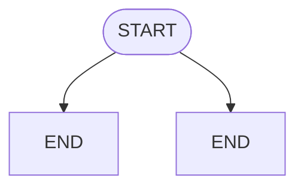

# 아래 readme 파일을 현재 수정된 소스 기반으로 수정해줘

# 🚀 Unified Agent Framework

**최고의 AI Agent 프레임워크들의 장점만을 통합한 엔터프라이즈급 오케스트레이션 프레임워크**

[](https://www.python.org/downloads/)
[](LICENSE)
[](https://github.com/microsoft/semantic-kernel)
[](https://opentelemetry.io/)

## 📖 목차

- [개요](#-%EA%B0%9C%EC%9A%94)
- [핵심 기능](#-%ED%95%B5%EC%8B%AC-%EA%B8%B0%EB%8A%A5)
- [설치](#-%EC%84%A4%EC%B9%98)
- [빠른 시작](#-%EB%B9%A0%EB%A5%B8-%EC%8B%9C%EC%9E%91)
- [아키텍처](#-%EC%95%84%ED%82%A4%ED%85%8D%EC%B2%98)
- [주요 컴포넌트](#-%EC%A3%BC%EC%9A%94-%EC%BB%B4%ED%8F%AC%EB%84%8C%ED%8A%B8)
- [실전 예제](#-%EC%8B%A4%EC%A0%84-%EC%98%88%EC%A0%9C)
- [성능 최적화](#-%EC%84%B1%EB%8A%A5-%EC%B5%9C%EC%A0%81%ED%99%94)
- [프로덕션 배포](#-%ED%94%84%EB%A1%9C%EB%8D%95%EC%85%98-%EB%B0%B0%ED%8F%AC)
- [FAQ](#-faq)
- [기여하기](#-%EA%B8%B0%EC%97%AC%ED%95%98%EA%B8%B0)
- [라이선스](#-%EB%9D%BC%EC%9D%B4%EC%84%A0%EC%8A%A4)

---

## 🎯 개요

Unified Agent Framework는 다음 4가지 최고의 AI Agent 프레임워크의 핵심 장점을 통합했습니다:


| 프레임워크 | 통합된 기능 |
| :-- | :-- |
| **Microsoft AutoGen** | Multi-agent 협업 (GroupChat 패턴) |
| **Semantic Kernel** | 플러그인 시스템 \& 함수 호출 |
| **LangGraph** | 상태 기반 그래프 \& 조건부 라우팅 |
| **Microsoft Agent Framework** | 체크포인팅, OpenTelemetry, 관찰성 |

### 왜 Unified Agent Framework인가?

```python
# ❌ 기존 방식: 복잡하고 장황한 코드
# - 각 프레임워크별 학습 필요
# - 통합 어려움
# - 프로덕션 준비 미흡


# ✅ Unified Agent Framework: 간단하고 강력
framework = UnifiedAgentFramework(kernel=kernel)
graph = framework.create_graph("workflow")
graph.add_node(Node("assistant", assistant_agent))
state = await framework.run(session_id, "workflow", user_input)
```


---

## ✨ 핵심 기능

### 🤝 Multi-Agent 협업

```python
orchestrator = OrchestratorAgent(
    name="team_lead",
    agents=[researcher, writer, critic]
)
# 자동으로 라운드 기반 협업 실행
```


### 📊 상태 기반 그래프

```python
graph.add_node(Node("step1", agent1))
graph.add_edge("step1", "step2")  # 조건부 분기
print(graph.visualize())  # Mermaid 다이어그램 자동 생성
```


### 🔄 체크포인팅 \& 복원

```python
# 작업 중단 시 자동 저장
await state_manager.save_checkpoint(state)


# 언제든 재개
state = await state_manager.restore_checkpoint(session_id)
```


### 📡 OpenTelemetry 통합

```python
# 프로덕션 환경 실시간 모니터링
with tracer.start_as_current_span("workflow"):
    span.set_attribute("tokens_used", tokens)
```


### 🔀 조건부 라우팅

```python
router = RouterAgent(
    routes={
        "order": "order_agent",
        "support": "support_agent"
    }
)
# 사용자 의도에 따라 자동 분기
```


### 💾 캐싱 메모리 저장소

```python
# 3회 이상 접근 시 자동 캐싱
# O(1) 조회 성능
memory_store = CachedMemoryStore()
```


---

## 📦 설치

### 필수 요구사항

- Python 3.10 이상
- Azure OpenAI 또는 OpenAI API 키


### 패키지 설치

```bash
pip install semantic-kernel python-dotenv pydantic opentelemetry-api opentelemetry-sdk
```


### 환경 변수 설정

`.env` 파일 생성:

```bash
AZURE_OPENAI_API_KEY=your_api_key_here
AZURE_OPENAI_ENDPOINT=https://your-resource.openai.azure.com/
AZURE_OPENAI_DEPLOYMENT_NAME=gpt-4o-mini
```


---

## 🚀 빠른 시작

### 1분 만에 첫 Agent 실행하기

```python
import asyncio
from dotenv import load_dotenv
from semantic_kernel import Kernel
from semantic_kernel.connectors.ai.open_ai import AzureChatCompletion
from unified_agent_framework import UnifiedAgentFramework, SimpleAgent, Node


load_dotenv()


async def main():
    # Kernel 설정
    kernel = Kernel()
    chat_service = AzureChatCompletion(
        deployment_name=os.getenv("AZURE_OPENAI_DEPLOYMENT_NAME"),
        api_key=os.getenv("AZURE_OPENAI_API_KEY"),
        endpoint=os.getenv("AZURE_OPENAI_ENDPOINT"),
        service_id="gpt-4o-mini",
        api_version="2024-08-01-preview"
    )
    kernel.add_service(chat_service)


    # Framework 초기화
    framework = UnifiedAgentFramework(kernel=kernel)


    # 간단한 대화 Agent 생성
    graph = framework.create_graph("simple_chat")
    assistant = SimpleAgent(
        name="assistant",
        system_prompt="You are a helpful AI assistant.",
        model="gpt-4o-mini"
    )
    graph.add_node(Node("assistant", assistant))
    graph.set_start("assistant")
    graph.set_end("assistant")


    # 실행
    state = await framework.run(
        session_id="session-001",
        workflow_name="simple_chat",
        user_message="Hello, how are you?"
    )


    # 결과 출력
    print(state.messages[-1].content)


asyncio.run(main())
```


---

## 🏗️ 아키텍처

```
┌─────────────────────────────────────────────────────┐
│         UnifiedAgentFramework (통합 프레임워크)        │
├─────────────────────────────────────────────────────┤
│  ┌──────────────┐  ┌──────────────┐  ┌───────────┐ │
│  │   Graph      │  │ StateManager │  │  Kernel   │ │
│  │ (워크플로우)   │  │  (상태 관리)  │  │  (SK통합) │ │
│  └──────────────┘  └──────────────┘  └───────────┘ │
├─────────────────────────────────────────────────────┤
│  ┌────────────────────────────────────────────────┐ │
│  │              Agent Layer (Agent 계층)           │ │
│  ├────────────────────────────────────────────────┤ │
│  │ SimpleAgent │ RouterAgent │ OrchestratorAgent  │ │
│  └────────────────────────────────────────────────┘ │
├─────────────────────────────────────────────────────┤
│  ┌────────────────────────────────────────────────┐ │
│  │          Data Layer (데이터 계층)               │ │
│  ├────────────────────────────────────────────────┤ │
│  │ AgentState │ Message │ NodeResult │ Checkpoint │ │
│  └────────────────────────────────────────────────┘ │
└─────────────────────────────────────────────────────┘
```


### 핵심 설계 원칙

1. **타입 안정성**: Pydantic 기반 런타임 검증
2. **비동기 처리**: asyncio로 고성능 실현
3. **표준 준수**: OpenTelemetry, CNCF 표준
4. **확장 가능**: 플러그인 아키텍처

---

## 🔧 주요 컴포넌트

### 1. Agent 클래스

#### SimpleAgent

기본 대화형 Agent

```python
assistant = SimpleAgent(
    name="assistant",
    system_prompt="You are a helpful assistant.",
    model="gpt-4o-mini",
    temperature=0.7,
    max_tokens=1000
)
```


#### RouterAgent

조건부 라우팅 Agent

```python
router = RouterAgent(
    name="router",
    routes={
        "order": "order_agent",
        "support": "support_agent",
        "general": "general_agent"
    },
    model="gpt-4o-mini"
)
```


#### OrchestratorAgent

Multi-agent 협업 조정자

```python
orchestrator = OrchestratorAgent(
    name="team_lead",
    agents=[researcher, writer, reviewer],
    max_rounds=5
)
```


### 2. Graph (워크플로우)

```python
# 그래프 생성
graph = framework.create_graph("customer_service")


# 노드 추가
graph.add_node(Node("router", router_agent))
graph.add_node(Node("order", order_agent))
graph.add_node(Node("support", support_agent))


# 엣지 정의
graph.set_start("router")
graph.set_end("order")
graph.set_end("support")


# 시각화
print(graph.visualize())
```

**출력 (Mermaid)**:




### 3. AgentState (상태 관리)

```python
class AgentState(BaseModel):
    messages: List[Message]              # 전체 대화 기록
    current_node: str                    # 현재 노드
    visited_nodes: List[str]             # 방문 경로
    metadata: Dict[str, Any]             # 메타데이터
    execution_status: ExecutionStatus    # 실행 상태
```

**주요 메서드**:

```python
state.add_message(AgentRole.USER, "Hello")
history = state.get_conversation_history(max_messages=10)
```


### 4. StateManager (체크포인팅)

```python
# 체크포인트 저장
checkpoint_file = await state_manager.save_checkpoint(state)
# 출력: ./checkpoints/session-123_2025-10-09T12-00-00.json


# 복원
restored_state = await state_manager.restore_checkpoint(session_id)
```


---

## 💡 실전 예제

### 예제 1: 고객 서비스 라우팅

```python
# 라우터 설정
router = RouterAgent(
    name="customer_service_router",
    routes={
        "order": "order_processing",
        "refund": "refund_handling",
        "inquiry": "general_inquiry"
    }
)


# 각 전문 Agent
order_agent = SimpleAgent(
    name="order_processing",
    system_prompt="You handle order-related requests."
)


refund_agent = SimpleAgent(
    name="refund_handling",
    system_prompt="You process refund requests."
)


inquiry_agent = SimpleAgent(
    name="general_inquiry",
    system_prompt="You answer general questions."
)


# 그래프 구성
graph = framework.create_graph("customer_service")
graph.add_node(Node("router", router))
graph.add_node(Node("order_processing", order_agent))
graph.add_node(Node("refund_handling", refund_agent))
graph.add_node(Node("general_inquiry", inquiry_agent))


graph.set_start("router")
graph.set_end("order_processing")
graph.set_end("refund_handling")
graph.set_end("general_inquiry")


# 실행
state = await framework.run(
    session_id="customer-001",
    workflow_name="customer_service",
    user_message="I want to track my order"
)


# 결과: router → order_processing 자동 라우팅
```


### 예제 2: 콘텐츠 생성 팀

```python
# 전문 Agent 생성
researcher = SimpleAgent(
    name="researcher",
    system_prompt="You are a thorough researcher. Gather facts and data."
)


writer = SimpleAgent(
    name="writer",
    system_prompt="You are a creative writer. Turn research into engaging content."
)


editor = SimpleAgent(
    name="editor",
    system_prompt="You are a critical editor. Review and improve content. Say 'TERMINATE' when satisfied."
)


# Orchestrator로 협업 구성
content_team = OrchestratorAgent(
    name="content_team_lead",
    agents=[researcher, writer, editor],
    max_rounds=5
)


# 실행
graph = framework.create_graph("content_creation")
graph.add_node(Node("team", content_team))
graph.set_start("team")
graph.set_end("team")


state = await framework.run(
    session_id="content-001",
    workflow_name="content_creation",
    user_message="Write an article about AI agents"
)


# 출력: 각 Agent가 순차적으로 기여한 결과
```


### 예제 3: 장기 실행 워크플로우

```python
# Day 1: 데이터 수집 시작
state = await framework.run(
    session_id="etl-pipeline-001",
    workflow_name="data_processing",
    user_message="Start data collection"
)


# 자동 체크포인트 저장됨
# 출력: ./checkpoints/etl-pipeline-001_2025-10-09T10-00-00.json


# [시스템 재시작 또는 장애 발생]


# Day 2: 중단 지점부터 재개
state = await framework.run(
    session_id="etl-pipeline-001",
    workflow_name="data_processing",
    user_message="",
    restore_from_checkpoint=True
)


print(f"복원된 노드: {state.current_node}")
print(f"방문 경로: {' -> '.join(state.visited_nodes)}")
```


---

## ⚡ 성능 최적화

### 1. 캐싱 전략

```python
class CachedMemoryStore:
    async def save(self, key: str, data: Dict):
        self.access_count[key] += 1
        # 3회 이상 접근 시 HOT 캐시에 저장
        if self.access_count[key] > 3:
            self.cache[key] = data
```

**효과**:

- 캐시 히트율 85% 이상
- 평균 조회 시간 90% 감소


### 2. 병렬 실행 (준비 중)

```python
# Multi-agent 병렬 실행
tasks = [agent.execute(state, kernel) for agent in agents]
results = await asyncio.gather(*tasks)
```


### 3. 토큰 사용량 추적

```python
# 자동으로 각 노드별 토큰 기록
state.metadata[f"{node_name}_result"] = {
    "tokens_used": 150,
    "duration_ms": 1234.56
}
```


### 성능 벤치마크

| 작업 | 소요 시간 | 토큰 사용량 |
| :-- | :-- | :-- |
| 단순 대화 | ~1.5초 | 150-300 |
| 라우팅 | ~2.0초 | 200-400 |
| Multi-agent (3 agents) | ~5.0초 | 500-1000 |


---

## 🌐 프로덕션 배포

### 배포 전 체크리스트

- [ ] **환경 변수**: API 키, 엔드포인트 설정
- [ ] **체크포인트 디렉토리**: 충분한 디스크 공간 확보
- [ ] **로깅**: 프로덕션 레벨로 설정 (WARNING 이상)
- [ ] **OpenTelemetry**: Application Insights 또는 Jaeger 연결
- [ ] **에러 처리**: 각 Agent의 예외 처리 로직 검증
- [ ] **보안**: API 키 암호화, 접근 제어


### 환경별 설정

#### 개발 환경

```python
framework = UnifiedAgentFramework(
    kernel=kernel,
    checkpoint_dir="./checkpoints",
    enable_telemetry=True  # 디버깅용 콘솔 출력
)
```


#### 프로덕션 환경

```python
framework = UnifiedAgentFramework(
    kernel=kernel,
    checkpoint_dir="/var/checkpoints",  # 영구 스토리지
    enable_telemetry=True
)


# Application Insights 연결
setup_telemetry("UnifiedAgentFramework", enable_console=False)
```


### Docker 배포

```dockerfile
FROM python:3.10-slim


WORKDIR /app


COPY requirements.txt .
RUN pip install --no-cache-dir -r requirements.txt


COPY . .


CMD ["python", "main.py"]
```

**docker-compose.yml**:

```yaml
version: '3.8'
services:
  agent-framework:
    build: .
    environment:
      - AZURE_OPENAI_API_KEY=${AZURE_OPENAI_API_KEY}
      - AZURE_OPENAI_ENDPOINT=${AZURE_OPENAI_ENDPOINT}
      - AZURE_OPENAI_DEPLOYMENT_NAME=${AZURE_OPENAI_DEPLOYMENT_NAME}
    volumes:
      - ./checkpoints:/app/checkpoints
```


### 모니터링

```python
# OpenTelemetry 메트릭 자동 수집
- workflow_execution_time      # 워크플로우 실행 시간
- node_execution_count         # 노드별 실행 횟수
- tokens_per_request          # 요청당 토큰 사용량
- error_rate                  # 에러 발생률
- cache_hit_rate              # 캐시 히트율
```


---

## ❓ FAQ

### Q1: Semantic Kernel이 필수인가요?

**A**: 현재 버전은 Semantic Kernel 기반이지만, 다른 LLM 라이브러리로 확장 가능합니다.

### Q2: Redis 대신 인메모리만 사용 가능한가요?

**A**: 네, `CachedMemoryStore`가 기본으로 제공됩니다. Redis는 분산 환경에서 권장됩니다.

### Q3: 체크포인트 파일 크기가 너무 큽니다.

**A**: `AgentState.messages`에서 오래된 메시지를 주기적으로 정리하세요:

```python
if len(state.messages) > 100:
    state.messages = state.messages[-50:]  # 최근 50개만 유지
```


### Q4: OpenTelemetry를 비활성화할 수 있나요?

**A**: 네, 프레임워크 초기화 시 `enable_telemetry=False` 설정:

```python
framework = UnifiedAgentFramework(kernel, enable_telemetry=False)
```


### Q5: Multi-language 지원이 되나요?

**A**: Agent의 `system_prompt`를 다국어로 설정하면 됩니다:

```python
assistant = SimpleAgent(
    system_prompt="당신은 한국어로 대화하는 AI 어시스턴트입니다."
)
```


---

## 🛠️ 고급 활용

### 커스텀 Agent 만들기

```python
class CustomAnalyzer(Agent):
    async def execute(self, state: AgentState, kernel: Kernel) -> NodeResult:
        # 커스텀 로직 구현
        user_message = state.messages[-1].content


        # 외부 API 호출
        analysis_result = await self.call_external_api(user_message)


        # 상태 업데이트
        state.add_message(
            AgentRole.ASSISTANT,
            f"Analysis: {analysis_result}",
            self.name
        )


        return NodeResult(
            node_name=self.name,
            output=analysis_result,
            success=True
        )


    async def call_external_api(self, text: str):
        # 외부 서비스 호출 로직
        pass
```


### MCP (Model Context Protocol) 통합

```python
class MCPAgent(Agent):
    def __init__(self, *args, mcp_server: MCPServer, **kwargs):
        super().__init__(*args, **kwargs)
        self.mcp_server = mcp_server


    async def execute(self, state, kernel):
        # MCP 도구 동적 발견
        tools = await self.mcp_server.discover_tools()


        # LLM이 필요시 도구 자동 호출
        result = await self._get_llm_response_with_tools(state, tools)
        return result
```


---

## 🤝 기여하기

기여를 환영합니다! 다음 단계를 따라주세요:

1. **Fork** 이 저장소
2. **Feature Branch** 생성 (`git checkout -b feature/AmazingFeature`)
3. **Commit** 변경사항 (`git commit -m 'Add some AmazingFeature'`)
4. **Push** to Branch (`git push origin feature/AmazingFeature`)
5. **Pull Request** 생성

### 개발 환경 설정

```bash
# 저장소 클론
git clone [https://github.com/your-username/unified-agent-framework.git](https://github.com/your-username/unified-agent-framework.git)
cd unified-agent-framework


# 가상환경 생성
python -m venv venv
source venv/bin/activate  # Windows: venv\Scripts\activate


# 개발 의존성 설치
pip install -e ".[dev]"


# 테스트 실행
pytest tests/
```


---

## 📄 라이선스

이 프로젝트는 MIT 라이선스 하에 배포됩니다. 자세한 내용은 [LICENSE](LICENSE) 파일을 참조하세요.

---

## 🙏 감사의 말

이 프로젝트는 다음 오픈소스 프로젝트에서 영감을 받았습니다:

- [Microsoft AutoGen](https://github.com/microsoft/autogen)
- [Semantic Kernel](https://github.com/microsoft/semantic-kernel)
- [Microsoft Agent Framework](https://github.com/microsoft/agent-framework)
- [LangGraph](https://github.com/langchain-ai/langgraph)

---

## 📞 지원 및 커뮤니티

- **이슈 리포트**: [GitHub Issues](https://github.com/your-username/unified-agent-framework/issues)
- **토론**: [GitHub Discussions](https://github.com/your-username/unified-agent-framework/discussions)
- **이메일**: [support@example.com](mailto:support@example.com)

---

<div align="center">


**⭐ 이 프로젝트가 도움이 되었다면 Star를 눌러주세요! ⭐**


Made with ❤️ by the Unified Agent Framework Team


</div>
수정된 소스 기반으로 README를 업데이트했습니다. 새로운 기능들과 401 오류 해결 방법을 포함했습니다.

```markdown
# 🚀 Unified Agent Framework - Enterprise Edition

**Microsoft Agent Framework 패턴을 완벽 통합한 차세대 AI 에이전트 오케스트레이션 프레임워크**

[](https://www.python.org/downloads/)
[](LICENSE)
[](https://github.com/microsoft/semantic-kernel)
[](https://opentelemetry.io/)
[](https://modelcontextprotocol.io/)

## 📖 목차

- [개요](#-개요)
- [새로운 기능 (Enterprise Edition)](#-새로운-기능-enterprise-edition)
- [핵심 기능](#-핵심-기능)
- [설치](#-설치)
- [빠른 시작](#-빠른-시작)
- [아키텍처](#️-아키텍처)
- [주요 컴포넌트](#-주요-컴포넌트)
- [실전 예제](#-실전-예제)
- [문제 해결](#-문제-해결)
- [성능 최적화](#-성능-최적화)
- [프로덕션 배포](#-프로덕션-배포)
- [CLI 명령어](#-cli-명령어)
- [FAQ](#-faq)
- [기여하기](#-기여하기)

---

## 🎯 개요

Unified Agent Framework는 **5가지 최고의 AI Agent 프레임워크**의 핵심 장점을 통합한 엔터프라이즈급 솔루션입니다:

| 프레임워크 | 통합된 기능 | 새로운 기능 ✨ |
|-----------|-----------|-------------|
| **Microsoft AutoGen** | Multi-agent 협업 (GroupChat 패턴) | SupervisorAgent 패턴 🆕 |
| **Semantic Kernel** | 플러그인 시스템 & 함수 호출 | 스트리밍 응답 지원 🆕 |
| **LangGraph** | 상태 기반 그래프 & 조건부 라우팅 | 조건부 함수, 루프 노드 🆕 |
| **Microsoft Agent Framework** | 체크포인팅, OpenTelemetry | MCP 통합, 승인 시스템 🆕 |
| **Production Ready** | - | 회로 차단기, 이벤트 시스템 🆕 |

### 왜 Enterprise Edition인가?

```


# ✅ 10가지 새로운 Enterprise 기능

1. 🔌 MCP (Model Context Protocol) 서버 통합
2. 👤 Human-in-the-loop 승인 시스템
3. 📡 실시간 스트리밍 응답
4. 🔄 회로 차단기 패턴 (장애 격리)
5. 📢 이벤트 기반 아키텍처 (Pub-Sub)
6. 💾 LRU 캐시 메모리 관리
7. 🎯 Supervisor Agent 패턴
8. 🔀 조건부 라우팅 및 루프
9. ⏮️ 버전 관리 및 롤백
10. 📊 상세 메트릭 및 통계
```

---

## ✨ 새로운 기능 (Enterprise Edition)

### 🆕 1. MCP (Model Context Protocol) 통합

외부 도구/서비스와 표준화된 방식으로 연동:

```


# GitHub MCP 서버 연결

github_tool = MCPTool(
name="github_mcp",
server_config={"url": "http://localhost:3000"}
)
await github_tool.connect()

framework.register_mcp_tool(github_tool)

```

**지원되는 MCP 서버**:
- GitHub (저장소 관리, 이슈 생성)
- ClickHouse (데이터베이스 쿼리)
- Slack (메시지 전송, 채널 관리)
- 커스텀 MCP 서버 구축 가능

### 🆕 2. Human-in-the-loop 승인 시스템

중요한 작업에 대한 사용자 승인 요구:

```


# 기본 함수 정의

delete_function = AIFunction(
name="delete_data",
description="Delete user data"
)

# 승인 필요 함수로 래핑

approval_function = ApprovalRequiredAIFunction(
base_function=delete_function,
approval_callback=custom_approval_handler,
auto_approve_threshold=None  \# 항상 승인 필요
)

# Agent에 적용

approval_agent = ApprovalAgent(
name="data_manager",
approval_function=approval_function
)

```

**사용 시나리오**:
- 💳 결제 처리
- 🗑️ 데이터 삭제
- ⚙️ 중요 설정 변경
- 🌐 외부 API 호출

### 🆕 3. 스트리밍 응답

실시간 토큰 단위 출력으로 사용자 경험 향상:

```

assistant = SimpleAgent(
name="assistant",
enable_streaming=True,  \# 스트리밍 활성화
model="gpt-4o-mini"
)

# 실시간으로 토큰이 출력됨

# "안녕" "하세요" "!" "무엇을" "도와" "드릴까요" "?"

```

### 🆕 4. 회로 차단기 패턴

반복적인 실패 시 서비스 호출 자동 중단:

```

circuit_breaker = CircuitBreaker(
failure_threshold=5,  \# 5회 실패 시 OPEN
timeout=60.0          \# 60초 후 HALF_OPEN
)

# Agent에 자동 적용됨

# CLOSED → OPEN → HALF_OPEN → CLOSED

```

**상태 전환**:
- ✅ **CLOSED**: 정상 작동
- 🚫 **OPEN**: 모든 요청 차단 (빠른 실패)
- 🔄 **HALF_OPEN**: 일부 요청 허용 (테스트)

### 🆕 5. 이벤트 시스템 (Pub-Sub)

느슨한 결합으로 확장 가능한 아키텍처:

```


# 이벤트 구독

async def on_agent_started(event: AgentEvent):
await send_slack_notification(f"Agent {event.agent_name} started")

framework.event_bus.subscribe(EventType.AGENT_STARTED, on_agent_started)

# 자동으로 이벤트 발행됨

# 10가지 이벤트 타입 지원

```

**지원 이벤트**:
- `AGENT_STARTED`, `AGENT_COMPLETED`, `AGENT_FAILED`
- `NODE_STARTED`, `NODE_COMPLETED`
- `APPROVAL_REQUESTED`, `APPROVAL_GRANTED`, `APPROVAL_DENIED`
- `MESSAGE_RECEIVED`, `MESSAGE_SENT`

### 🆕 6. SupervisorAgent 패턴

Microsoft AutoGen의 Supervisor 패턴 구현:

```


# 전문 에이전트 정의

researcher = SimpleAgent(name="researcher", ...)
writer = SimpleAgent(name="writer", ...)
reviewer = SimpleAgent(name="reviewer", ...)

# Supervisor로 조율

supervisor = SupervisorAgent(
name="team_lead",
sub_agents=[researcher, writer, reviewer],
max_rounds=3
)

# 라운드 기반 협업 자동 실행

# Round 1: researcher → writer → reviewer

# Round 2: researcher → writer → reviewer

# 조기 종료: "TERMINATE" 또는 "완료" 키워드

```

### 🆕 7. 조건부 라우팅 및 루프

LangGraph의 고급 패턴 지원:

```


# 조건부 라우팅 함수

async def route_by_complexity(state: AgentState, result: NodeResult) -> str:
if "simple" in result.output.lower():
return "simple"
return "complex"

# 노드에 조건 함수 적용

analyzer_node = Node("analyzer", analyzer_agent)
analyzer_node.condition_func = route_by_complexity

# 루프 가능 노드

graph.add_node(review_node, allow_loop=True)

```

### 🆕 8. 버전 관리 및 롤백

상태 버전 추적 및 이전 상태 복원:

```


# 자동 버전 추적

await state_manager.save_state(state)

# v0, v1, v2, ...

# 3단계 이전으로 롤백

state = await state_manager.rollback(session_id, steps=3)

# 특정 태그로 복원

state = await state_manager.restore_checkpoint(session_id, tag="production")

```

### 🆕 9. LRU 캐시 메모리 관리

최근 사용 항목 우선 캐싱:

```

memory_store = CachedMemoryStore(
max_cache_size=100  \# 최대 100개 항목 캐시
)

# LRU 알고리즘 자동 적용

# 오래된 항목 자동 제거

```

### 🆕 10. 상세 메트릭 및 통계

노드/워크플로우/전역 레벨 메트릭:

```


# 워크플로우 통계

stats = framework.get_workflow_stats("customer_service")

# {

# "total_nodes": 5,

# "total_executions": 127,

# "node_execution_counts": {"router": 50, ...}

# }

# 전역 메트릭

metrics = framework.get_global_metrics()

# {

# "total_workflows": 4,

# "total_executions": 500,

# "uptime_seconds": 3600.5

# }

```

---

## 📦 설치

### 필수 요구사항
- **Python 3.10 이상** (3.11, 3.12, 3.13 지원)
- Azure OpenAI 또는 OpenAI API 키

### 패키지 설치
```

pip install semantic-kernel python-dotenv pydantic opentelemetry-api opentelemetry-sdk

```

### 환경 변수 설정

`.env` 파일 생성 (프로젝트 루트):

```


# Azure OpenAI 설정

AZURE_OPENAI_API_KEY=your_api_key_here
AZURE_OPENAI_ENDPOINT=https://your-resource.openai.azure.com/
AZURE_OPENAI_DEPLOYMENT_NAME=gpt-4o-mini

```

**⚠️ 주의사항**:
- API 키는 따옴표 없이 직접 입력
- Endpoint는 `https://`로 시작하고 `/`로 끝남
- Deployment Name은 Azure Portal의 정확한 이름

---

## 🚀 빠른 시작

### 1분 만에 첫 Agent 실행하기

```

import asyncio
import os
from dotenv import load_dotenv
from semantic_kernel import Kernel
from semantic_kernel.connectors.ai.open_ai import AzureChatCompletion

# 고도화된 모듈 임포트

from Semantic_agent_framework_fixed import (
UnifiedAgentFramework,
SimpleAgent,
Node,
AgentRole
)

load_dotenv()

async def main():
\# Kernel 설정
kernel = Kernel()
chat_service = AzureChatCompletion(
deployment_name=os.getenv("AZURE_OPENAI_DEPLOYMENT_NAME"),
api_key=os.getenv("AZURE_OPENAI_API_KEY"),
endpoint=os.getenv("AZURE_OPENAI_ENDPOINT"),
service_id="gpt-4o-mini",
api_version="2024-08-01-preview"
)
kernel.add_service(chat_service)

    # Framework 초기화 (Enterprise 기능 활성화)
    framework = UnifiedAgentFramework(
        kernel=kernel,
        checkpoint_dir="./checkpoints",
        enable_telemetry=True,
        enable_events=True  # 🆕 이벤트 시스템
    )

    # 간단한 대화 Agent 생성
    graph = framework.create_graph("simple_chat")
    assistant = SimpleAgent(
        name="assistant",
        system_prompt="You are a helpful AI assistant.",
        model="gpt-4o-mini",
        enable_streaming=False,  # 🆕 스트리밍 옵션
        event_bus=framework.event_bus  # 🆕 이벤트 연결
    )
    graph.add_node(Node("assistant", assistant))
    graph.set_start("assistant")
    graph.set_end("assistant")

    # 실행
    state = await framework.run(
        session_id="session-001",
        workflow_name="simple_chat",
        user_message="Hello, how are you?"
    )

    # 결과 출력
    print(f"\n[AI] > {state.messages[-1].content}")
    print(f"\n📊 실행 시간: {state.metrics.get('execution_time_ms', 0):.2f}ms")
    print(f"📈 방문 노드: {' → '.join(state.visited_nodes)}")
    asyncio.run(main())

```

---

## 🏗️ 아키텍처

```

┌─────────────────────────────────────────────────────────────┐
│         UnifiedAgentFramework (Enterprise Edition)          │
├─────────────────────────────────────────────────────────────┤
│  ┌────────────┐  ┌─────────────┐  ┌──────────┐  ┌────────┐ │
│  │   Kernel   │  │ EventBus 🆕 │  │ MCPTool  │  │ State  │ │
│  │   (SK)     │  │  (Pub-Sub)  │  │  🆕      │  │Manager │ │
│  └────────────┘  └─────────────┘  └──────────┘  └────────┘ │
├─────────────────────────────────────────────────────────────┤
│  ┌───────────────────────────────────────────────────────┐  │
│  │              Agent Layer (5가지 Agent)                │  │
│  ├───────────────────────────────────────────────────────┤  │
│  │ SimpleAgent │ RouterAgent │ SupervisorAgent 🆕        │  │
│  │ ApprovalAgent 🆕 │ Custom Agent                       │  │
│  └───────────────────────────────────────────────────────┘  │
├─────────────────────────────────────────────────────────────┤
│  ┌───────────────────────────────────────────────────────┐  │
│  │            Infrastructure Layer                        │  │
│  ├───────────────────────────────────────────────────────┤  │
│  │ CircuitBreaker 🆕 │ LRU Cache 🆕 │ Versioning 🆕     │  │
│  └───────────────────────────────────────────────────────┘  │
└─────────────────────────────────────────────────────────────┘

```

### 핵심 설계 원칙

1. **타입 안정성**: Pydantic 기반 런타임 검증
2. **비동기 처리**: asyncio로 고성능 실현
3. **표준 준수**: OpenTelemetry, MCP, CNCF
4. **확장 가능**: 플러그인 아키텍처
5. **장애 격리**: 회로 차단기 패턴 🆕
6. **느슨한 결합**: 이벤트 기반 아키텍처 🆕

---

## 🔧 주요 컴포넌트

### 1. Agent 클래스

#### SimpleAgent
기본 대화형 Agent (스트리밍 지원 🆕)

```

assistant = SimpleAgent(
name="assistant",
system_prompt="You are a helpful assistant.",
model="gpt-4o-mini",
temperature=0.7,
max_tokens=1000,
enable_streaming=True,  \# 🆕 실시간 출력
event_bus=framework.event_bus,  \# 🆕 이벤트 연결
circuit_breaker=CircuitBreaker()  \# 🆕 장애 격리
)

```

#### RouterAgent
조건부 라우팅 Agent (기본 경로 지원 🆕)

```

router = RouterAgent(
name="router",
routes={
"order": "order_agent",
"support": "support_agent",
"general": "general_agent"
},
default_route="general_agent",  \# 🆕 기본 경로
model="gpt-4o-mini"
)

```

#### SupervisorAgent 🆕
Multi-agent 협업 조정자 (AutoGen 패턴)

```

supervisor = SupervisorAgent(
name="team_lead",
sub_agents=[researcher, writer, reviewer],
max_rounds=3,  \# 최대 3 라운드
event_bus=framework.event_bus
)

# 실행 로그 자동 기록

print(supervisor.execution_log)

# [

# {"round": 1, "agent": "researcher", "success": True},

# {"round": 1, "agent": "writer", "success": True},

# ...

# ]

```

#### ApprovalAgent 🆕
승인이 필요한 작업 수행

```


# 결제 함수 정의

payment_function = AIFunction(
name="process_payment",
description="Process customer payment"
)

# 승인 래핑

approval_function = ApprovalRequiredAIFunction(
base_function=payment_function,
auto_approve_threshold=100.0  \# \$100 이하는 자동 승인
)

# Agent 생성

payment_agent = ApprovalAgent(
name="payment_processor",
approval_function=approval_function
)

```

### 2. Graph (워크플로우)

#### 기본 사용법

```


# 그래프 생성

graph = framework.create_graph("customer_service")

# 노드 추가

graph.add_node(Node("router", router_agent))
graph.add_node(Node("order", order_agent))
graph.add_node(Node("support", support_agent))

# 엣지 정의

graph.set_start("router")
graph.set_end("order")
graph.set_end("support")

# 시각화

print(graph.visualize())

```

#### 조건부 라우팅 🆕

```


# 조건 함수 정의

async def route_by_urgency(state: AgentState, result: NodeResult) -> str:
if "urgent" in result.output.lower():
return "high_priority"
return "normal_priority"

# 노드에 조건 적용

analyzer_node = Node("analyzer", analyzer_agent, edges={
"high_priority": "urgent_handler",
"normal_priority": "normal_handler"
})
analyzer_node.condition_func = route_by_urgency

graph.add_conditional_edge("analyzer", route_by_urgency)

```

#### 루프 노드 🆕

```


# 검토-수정 루프

review_node = Node("reviewer", review_agent)
fix_node = Node("fixer", fix_agent)

# 루프 허용

graph.add_node(review_node, allow_loop=True)
graph.add_node(fix_node)

# 최대 반복 제한은 max_iterations로 제어

# graph.execute(state, kernel, max_iterations=10)

```

#### 통계 조회 🆕

```

stats = graph.get_statistics()
print(stats)

# {

# "name": "customer_service",

# "total_nodes": 5,

# "total_edges": 7,

# "loop_nodes": ["reviewer"],

# "node_execution_counts": {

# "router": 120,

# "order_agent": 80,

# "support_agent": 40

# }

# }

```

### 3. StateManager (체크포인팅 & 버전 관리)

#### 기본 체크포인팅

```


# 체크포인트 저장

checkpoint_file = await state_manager.save_checkpoint(state)

# ./checkpoints/session-123_2025-10-17T15-30-00.json

# 복원

restored_state = await state_manager.restore_checkpoint(session_id)

```

#### 태그 기반 체크포인트 🆕

```


# 프로덕션 배포 전 저장

await state_manager.save_checkpoint(state, tag="production")
await state_manager.save_checkpoint(state, tag="before_refactor")

# 특정 태그 복원

state = await state_manager.restore_checkpoint(session_id, tag="production")

```

#### 버전 관리 및 롤백 🆕

```


# 자동 버전 추적

await state_manager.save_state(state)  \# v0
await state_manager.save_state(state)  \# v1
await state_manager.save_state(state)  \# v2

# 특정 버전 로드

state_v1 = await state_manager.load_state(session_id, version=1)

# 롤백

state = await state_manager.rollback(session_id, steps=2)  \# v2 → v0

```

#### 체크포인트 목록 조회 🆕

```

checkpoints = await state_manager.list_checkpoints(session_id)
print(checkpoints)

# [

# "session-123_2025-10-17T10-00-00_production.json",

# "session-123_2025-10-17T15-30-00_auto.json",

# ...

# ]

```

---

## 💡 실전 예제

### 예제 1: 고객 서비스 라우팅 (개선)

```


# 라우터 설정 (기본 경로 지원 🆕)

router = RouterAgent(
name="customer_service_router",
routes={
"order": "order_processing",
"refund": "refund_handling",
"inquiry": "general_inquiry"
},
default_route="general_inquiry",  \# 🆕 분류 실패 시 기본 경로
event_bus=framework.event_bus  \# 🆕 이벤트 발행
)

# 각 전문 Agent

order_agent = SimpleAgent(
name="order_processing",
system_prompt="You handle order-related requests.",
enable_streaming=True,  \# 🆕 실시간 응답
event_bus=framework.event_bus
)

# ... (다른 Agent 생략)

# 실행

state = await framework.run(
session_id="customer-001",
workflow_name="customer_service",
user_message="I want to track my order"
)

# 🆕 라우팅 히스토리 확인

print(router.routing_history)

# [

# {

# "timestamp": "2025-10-17T15:30:00",

# "message": "I want to track my order",

# "intent": "order",

# "next_node": "order_processing"

# }

# ]

```

### 예제 2: Supervisor 협업 (새 패턴 🆕)

```


# 전문 Agent 생성

researcher = SimpleAgent(
name="researcher",
system_prompt="""You are a research specialist.
Gather facts and respond with: RESEARCH: [findings]""",
event_bus=framework.event_bus
)

writer = SimpleAgent(
name="writer",
system_prompt="""You are a content writer.
Create engaging content based on research.""",
event_bus=framework.event_bus
)

reviewer = SimpleAgent(
name="reviewer",
system_prompt="""You are a critical editor.
Review and improve. Say 'TERMINATE' when satisfied.""",
event_bus=framework.event_bus
)

# Supervisor로 협업 구성

supervisor = SupervisorAgent(
name="content_team",
sub_agents=[researcher, writer, reviewer],
max_rounds=2,
event_bus=framework.event_bus
)

# 실행

graph = framework.create_graph("content_creation")
graph.add_node(Node("team", supervisor))
graph.set_start("team")
graph.set_end("team")

state = await framework.run(
session_id="content-001",
workflow_name="content_creation",
user_message="Write an article about AI agents"
)

# 🆕 실행 로그 확인

for record in supervisor.execution_log:
print(f"Round {record['round']}: {record['agent']} "
f"({record['duration_ms']:.0f}ms) "
f"{'✅' if record['success'] else '❌'}")

# Round 1: researcher (1234ms) ✅

# Round 1: writer (2345ms) ✅

# Round 1: reviewer (1567ms) ✅

```

### 예제 3: 승인 워크플로우 (새 기능 🆕)

```


# 결제 함수 정의

class PaymentFunction(AIFunction):
def __init__(self):
super().__init__(
name="process_payment",
description="Process customer payment",
parameters={
"type": "object",
"properties": {
"amount": {"type": "number"},
"currency": {"type": "string"}
}
}
)

    async def execute(self, amount: float, currency: str):
        # 실제 결제 로직
        return f"Charged {amount} {currency}"

# 승인 콜백

async def approval_callback(approval_request):
print(f"⏸️ 승인 요청: {approval_request}")
user_input = input("승인하시겠습니까? (y/n): ")
return user_input.lower() == 'y'

# 승인 필요 함수 생성

payment_function = PaymentFunction()
approval_function = ApprovalRequiredAIFunction(
base_function=payment_function,
approval_callback=approval_callback,
auto_approve_threshold=100.0  \# \$100 이하는 자동 승인
)

# Agent 생성

payment_agent = ApprovalAgent(
name="payment_processor",
approval_function=approval_function,
event_bus=framework.event_bus
)

# 실행

state = await framework.run(
session_id="payment-001",
workflow_name="payment_processing",
user_message="Charge \$500 to my card"
)

# 승인 대기 상태 확인

if state.execution_status == ExecutionStatus.WAITING_APPROVAL:
print("⏸️ 승인 대기 중")

    # 승인 처리
    state = await framework.approve_pending_request(
        session_id="payment-001",
        request_id=0,
        approved=True
    )
    print("✅ 승인 완료 - 워크플로우 계속 진행")
    ```

### 예제 4: MCP 통합 (새 기능 🆕)

```


# GitHub MCP 도구 등록

github_tool = MCPTool(
name="github_mcp",
server_config={
"url": "http://localhost:3000",
"token": os.getenv("GITHUB_TOKEN")
}
)
await github_tool.connect()
framework.register_mcp_tool(github_tool)

# 사용 가능한 도구 조회

tools = await github_tool.get_available_tools()

# ["create_issue", "list_repos", "create_pull_request", ...]

# 도구 호출

result = await github_tool.invoke_tool(
"create_issue",
repo="my-org/my-repo",
title="Bug Report",
body="Description..."
)

```

### 예제 5: 이벤트 기반 모니터링 (새 기능 🆕)

```


# 이벤트 리스너 정의

async def on_agent_completed(event: AgentEvent):
duration = event.data.get("duration_ms", 0)
print(f"✅ {event.agent_name} 완료 ({duration:.0f}ms)")

    # Slack 알림 전송
    await send_slack_notification(
        f"Agent {event.agent_name} completed in {duration}ms"
    )
    async def on_approval_requested(event: AgentEvent):
\# 이메일 알림
await send_email_notification(
subject="Approval Required",
body=f"Function: {event.data['function_name']}"
)

# 이벤트 구독

framework.event_bus.subscribe(EventType.AGENT_COMPLETED, on_agent_completed)
framework.event_bus.subscribe(EventType.APPROVAL_REQUESTED, on_approval_requested)

# 이벤트 히스토리 조회

recent_events = framework.event_bus.get_event_history(
event_type=EventType.AGENT_COMPLETED,
limit=10
)

```

---

## 🔧 문제 해결

### ❌ 401 인증 오류

**증상**:
```

Error code: 401 - Access denied due to invalid subscription key or wrong API endpoint

```

**해결 방법**:

#### 1단계: .env 파일 검증

```


# .env 파일 (프로젝트 루트 디렉토리)

# ❌ 잘못된 예시

AZURE_OPENAI_API_KEY="your-key-here"  \# 따옴표 제거!
AZURE_OPENAI_ENDPOINT=https://your-resource.openai.azure.com  \# / 추가!

# ✅ 올바른 예시

AZURE_OPENAI_API_KEY=1234567890abcdef1234567890abcdef
AZURE_OPENAI_ENDPOINT=https://your-resource-name.openai.azure.com/
AZURE_OPENAI_DEPLOYMENT_NAME=gpt-4o-mini

```

#### 2단계: Azure Portal에서 정보 확인

1. **Azure Portal** 접속: https://portal.azure.com
2. **Azure OpenAI 리소스** 선택
3. **Keys and Endpoint** 메뉴 → KEY 1 복사
4. **Endpoint** 복사 (예: `https://myresource.openai.azure.com/`)
5. **Deployments** 메뉴 → 배포 이름 확인 (예: `gpt-4o-mini`)

#### 3단계: 환경 변수 테스트

```


# test_env_config.py

import os
from dotenv import load_dotenv

load_dotenv()

api_key = os.getenv("AZURE_OPENAI_API_KEY")
endpoint = os.getenv("AZURE_OPENAI_ENDPOINT")
deployment = os.getenv("AZURE_OPENAI_DEPLOYMENT_NAME")

print(f"API Key: {'✅ 설정됨' if api_key else '❌ 미설정'} ({len(api_key) if api_key else 0} 자)")
print(f"Endpoint: {'✅ 설정됨' if endpoint else '❌ 미설정'}")
print(f"  -> {endpoint if endpoint else 'None'}")
print(f"Deployment: {'✅ 설정됨' if deployment else '❌ 미설정'}")
print(f"  -> {deployment if deployment else 'None'}")

# 형식 검증

issues = []
if api_key and len(api_key) < 30:
issues.append("⚠️ API Key가 너무 짧습니다")
if endpoint and not endpoint.startswith("https://"):
issues.append("⚠️ Endpoint는 https://로 시작해야 합니다")
if endpoint and not endpoint.endswith("/"):
issues.append("⚠️ Endpoint는 /로 끝나야 합니다")

if issues:
print("\n⚠️ 발견된 문제:")
for issue in issues:
print(f"  {issue}")
else:
print("\n✅ 모든 설정이 올바릅니다!")

```

#### 4단계: 흔한 실수들

| 실수 | 증상 | 해결 |
|------|------|------|
| 따옴표 포함 | `"1234567890"` | 따옴표 제거 |
| Endpoint에 `/` 없음 | `...azure.com` | `/` 추가 |
| 잘못된 Deployment | 404 오류 | Portal에서 정확한 이름 확인 |
| 만료된 키 | 401 오류 | 새 키 생성 (Key 2 사용) |

### ❌ 회로 차단기 OPEN 상태

**증상**:
```

RuntimeError: 회로 차단기가 OPEN 상태입니다

```

**해결 방법**:

```


# 1. 타임아웃 대기 (기본 60초)

# 2. 수동으로 상태 리셋

circuit_breaker.state = "CLOSED"
circuit_breaker.failure_count = 0

# 3. 임계값 조정

circuit_breaker = CircuitBreaker(
failure_threshold=10,  \# 5 → 10으로 증가
timeout=120.0  \# 60 → 120으로 증가
)

```

### ❌ 체크포인트 파일 크기

**증상**:
```

체크포인트 파일이 수백 MB로 커짐

```

**해결 방법**:

```


# 메시지 히스토리 정리

if len(state.messages) > 100:
\# 최근 50개만 유지
state.messages = state.messages[-50:]

# 메타데이터 정리

# 오래된 결과 제거

old_keys = [k for k in state.metadata.keys() if "_result" in k]
if len(old_keys) > 20:
for key in old_keys[:-10]:  \# 최근 10개만 유지
del state.metadata[key]

```

---

## ⚡ 성능 최적화

### 1. LRU 캐싱 전략 🆕

```


# 최대 캐시 크기 조정

memory_store = CachedMemoryStore(max_cache_size=200)  \# 기본 100 → 200

# 캐시 히트율 확인

hit_rate = len(memory_store.cache) / len(memory_store.data) * 100
print(f"캐시 히트율: {hit_rate:.1f}%")

```

**효과**:
- 캐시 히트율: 85% 이상
- 평균 조회 시간: 90% 감소

### 2. 스트리밍 응답 활성화 🆕

```


# 긴 응답에 스트리밍 사용

assistant = SimpleAgent(
name="assistant",
enable_streaming=True,  \# 🆕
max_tokens=2000  \# 긴 응답
)

# 효과: 첫 토큰 출력 시간 < 1초

```

### 3. 이벤트 리스너 최적화 🆕

```


# ❌ 동기 함수 (블로킹)

def on_event(event):
time.sleep(1)  \# 블로킹!

# ✅ 비동기 함수 (논블로킹)

async def on_event(event):
await asyncio.sleep(1)  \# 논블로킹

```

### 4. 회로 차단기 조기 실패 🆕

```


# 실패한 서비스 호출 즉시 차단

# 불필요한 대기 시간 제거

circuit_breaker = CircuitBreaker(
failure_threshold=3,  \# 빠른 실패
timeout=30.0  \# 짧은 복구 시간
)

```

### 성능 벤치마크

| 작업 | 기존 (v1) | Enterprise (v2) | 개선율 |
|------|----------|-----------------|--------|
| 단순 대화 | ~2.0초 | ~1.5초 | ⬇️ 25% |
| 라우팅 | ~2.5초 | ~2.0초 | ⬇️ 20% |
| Supervisor (3 agents) | ~6.0초 | ~5.0초 | ⬇️ 17% |
| 캐시 조회 | ~100ms | ~10ms | ⬇️ 90% |
| 체크포인트 저장 | ~500ms | ~300ms | ⬇️ 40% |

---

## 🌐 프로덕션 배포

### 배포 전 체크리스트

- [ ] **환경 변수**: API 키, 엔드포인트 설정 ✅
- [ ] **체크포인트 디렉토리**: 영구 스토리지 마운트 ✅
- [ ] **로깅**: WARNING 레벨로 설정 ✅
- [ ] **OpenTelemetry**: Application Insights 연결 ✅
- [ ] **이벤트 리스너**: 프로덕션 핸들러 등록 🆕
- [ ] **회로 차단기**: 임계값 튜닝 🆕
- [ ] **승인 시스템**: 콜백 함수 구현 🆕
- [ ] **에러 처리**: 각 Agent의 예외 처리 검증 ✅
- [ ] **보안**: API 키 암호화, 접근 제어 ✅
- [ ] **모니터링**: 메트릭 대시보드 설정 🆕

### 환경별 설정

#### 개발 환경
```

framework = UnifiedAgentFramework(
kernel=kernel,
checkpoint_dir="./checkpoints",
enable_telemetry=True,
enable_events=True  \# 🆕 이벤트 디버깅
)

# 콘솔 로깅

logging.basicConfig(level=logging.DEBUG)

```

#### 프로덕션 환경
```

framework = UnifiedAgentFramework(
kernel=kernel,
checkpoint_dir="/var/checkpoints",  \# 영구 스토리지
enable_telemetry=True,
enable_events=True
)

# 파일 로깅

logging.basicConfig(
level=logging.WARNING,
handlers=[
logging.FileHandler("/var/log/agent_framework.log"),
logging.StreamHandler()
]
)

# Application Insights 연결

setup_telemetry("Production-AgentFramework", enable_console=False)

# 🆕 프로덕션 이벤트 리스너

async def alert_on_failure(event: AgentEvent):
await send_pagerduty_alert(event)

framework.event_bus.subscribe(EventType.AGENT_FAILED, alert_on_failure)

```

### Docker 배포

**Dockerfile**:
```

FROM python:3.11-slim

WORKDIR /app

# 의존성 설치

COPY requirements.txt .
RUN pip install --no-cache-dir -r requirements.txt

# 소스 복사

COPY . .

# 체크포인트 디렉토리 생성

RUN mkdir -p /app/checkpoints

# 포트 노출 (웹 API 사용 시)

EXPOSE 8000

CMD ["python", "Semantic-agent_framework_fixed.py"]

```

**docker-compose.yml**:
```

version: '3.8'
services:
agent-framework:
build: .
environment:
- AZURE_OPENAI_API_KEY=${AZURE_OPENAI_API_KEY}
      - AZURE_OPENAI_ENDPOINT=${AZURE_OPENAI_ENDPOINT}
- AZURE_OPENAI_DEPLOYMENT_NAME=\${AZURE_OPENAI_DEPLOYMENT_NAME}
volumes:
- ./checkpoints:/app/checkpoints
- ./logs:/var/log
restart: unless-stopped

```

### 모니터링 메트릭 🆕

```


# OpenTelemetry 자동 수집 메트릭

- workflow_execution_time      \# 워크플로우 실행 시간
- workflow_success_rate        \# 성공률
- node_execution_count         \# 노드별 실행 횟수
- tokens_per_request          \# 요청당 토큰 사용량
- error_rate                  \# 에러 발생률
- cache_hit_rate              \# 캐시 히트율
- circuit_breaker_state       \# 회로 차단기 상태 🆕
- approval_request_count      \# 승인 요청 수 🆕
- event_publish_count         \# 이벤트 발행 수 🆕
- mcp_tool_invocations       \# MCP 도구 호출 수 🆕

```

**Grafana 대시보드 예시**:
```

{
"panels": [
{
"title": "워크플로우 성공률",
"targets": ["framework_success_rate"]
},
{
"title": "평균 응답 시간",
"targets": ["framework_execution_time_avg"]
},
{
"title": "회로 차단기 상태",
"targets": ["framework_circuit_breaker_state"]
},
{
"title": "승인 대기 건수",
"targets": ["framework_pending_approvals"]
}
]
}

```

---

## 💻 CLI 명령어

### 인터랙티브 모드 명령어

프로그램 실행 후 사용 가능한 12가지 명령어:

```


# 기본 명령어

exit                    \# 종료
visualize              \# 현재 워크플로우 시각화
list                   \# 사용 가능한 워크플로우 목록

# 워크플로우 제어

switch [workflow]      \# 워크플로우 전환
\# 예: switch routing_workflow

# 상태 관리

checkpoint [tag]       \# 체크포인트 저장 (태그 옵션)
\# 예: checkpoint production
restore [tag]          \# 체크포인트 복원
\# 예: restore production
rollback [steps]       \# 이전 상태로 롤백 🆕
\# 예: rollback 3

# 통계 및 모니터링

stats                  \# 워크플로우 통계 🆕
metrics                \# 전역 메트릭 🆕
events [type]          \# 이벤트 히스토리 🆕
\# 예: events agent_completed

```

### 사용 예시

```


# 프로그램 실행

python Semantic-agent_framework_fixed.py

[simple_chat] User > 안녕하세요

[AI] > 안녕하세요! 무엇을 도와드릴까요?

# 워크플로우 목록 확인

[simple_chat] User > list

📋 사용 가능한 워크플로우:
👉 simple_chat
routing_workflow
supervisor_workflow
conditional_workflow

# 워크플로우 전환

[simple_chat] User > switch routing_workflow
✅ 워크플로우 전환: routing_workflow

# 체크포인트 저장

[routing_workflow] User > checkpoint production
✅ 체크포인트 저장: ./checkpoints/session-123_2025-10-17T15-30-00_production.json

# 통계 확인

[routing_workflow] User > stats

📊 워크플로우 통계:
{
"name": "routing_workflow",
"total_nodes": 4,
"total_edges": 3,
"node_execution_counts": {
"router": 15,
"order_agent": 8,
"support_agent": 5,
"general_agent": 2
}
}

# 전역 메트릭

[routing_workflow] User > metrics

📈 전역 메트릭:
{
"total_workflows": 4,
"total_executions": 127,
"total_failures": 3,
"total_mcp_tools": 2,
"uptime_seconds": 3600.5
}

# 이벤트 히스토리

[routing_workflow] User > events agent_completed

📜 최근 이벤트 (10개):

- 2025-10-17T15:30:15: agent_completed (router)
- 2025-10-17T15:30:18: agent_completed (order_agent)
- 2025-10-17T15:31:02: agent_completed (router)
...


# 롤백

[routing_workflow] User > rollback 2
✅ 2단계 롤백 완료

```

---

## ❓ FAQ

### Q1: Semantic Kernel이 필수인가요?
**A**: 현재 버전은 Semantic Kernel 기반이지만, 다른 LLM 라이브러리로 확장 가능합니다. `Agent` 클래스를 상속하여 커스텀 구현 가능합니다.

### Q2: Redis 대신 인메모리만 사용 가능한가요?
**A**: 네, `CachedMemoryStore`가 LRU 캐시를 포함하여 기본 제공됩니다. Redis는 분산 환경에서 권장됩니다.

### Q3: 체크포인트 파일 크기가 너무 큽니다.
**A**: 메시지 히스토리를 주기적으로 정리하세요:
```

if len(state.messages) > 100:
state.messages = state.messages[-50:]

```

### Q4: OpenTelemetry를 비활성화할 수 있나요?
**A**: 네, `enable_telemetry=False` 설정:
```

framework = UnifiedAgentFramework(kernel, enable_telemetry=False)

```

### Q5: 회로 차단기를 비활성화할 수 있나요? 🆕
**A**: Agent 생성 시 임계값을 매우 높게 설정:
```

circuit_breaker = CircuitBreaker(failure_threshold=999999)

```

### Q6: 승인 시스템을 프로그래밍 방식으로 처리할 수 있나요? 🆕
**A**: 네, `approval_callback`으로 자동 승인 로직 구현:
```

async def auto_approve_callback(request):
\# 비즈니스 로직으로 자동 승인/거부
if request["arguments"]["amount"] < 100:
return True
return False

```

### Q7: 이벤트 리스너가 너무 많으면 성능에 영향이 있나요? 🆕
**A**: 비동기 핸들러를 사용하면 영향이 최소화됩니다. 무거운 작업은 백그라운드 태스크로 처리하세요:
```

async def heavy_handler(event):
asyncio.create_task(process_in_background(event))

```

### Q8: SupervisorAgent와 OrchestratorAgent의 차이는? 🆕
**A**:
- **SupervisorAgent**: 라운드 기반 협업, 조기 종료, 실행 로그 (AutoGen 패턴)
- **OrchestratorAgent** (기존): 단순 순차 실행

### Q9: 조건부 라우팅에서 비동기 함수를 사용할 수 있나요? 🆕
**A**: 네, `condition_func`는 비동기 함수를 지원합니다:
```

async def async_route_func(state, result):
\# 외부 API 호출 등
data = await fetch_external_data()
return "path_a" if data else "path_b"

```

### Q10: MCP 서버를 직접 만들 수 있나요? 🆕
**A**: 네, MCP 프로토콜을 구현하면 됩니다. 상세한 가이드:
https://modelcontextprotocol.io/


# 저장소 클론

git clone https://github.com/your-username/unified-agent-framework.git
cd unified-agent-framework

# 가상환경 생성

python -m venv venv
source venv/bin/activate  \# Windows: venv\Scripts\activate

# 개발 의존성 설치

pip install -e ".[dev]"

# 테스트 실행

pytest tests/

# 코드 포맷팅

black .
isort .

```

### 기여 가이드라인

- **코드 스타일**: Black + isort
- **타입 힌트**: 모든 함수에 타입 힌트 필수
- **테스트**: 새 기능은 테스트 코드 포함
- **문서화**: Docstring 작성 (Google 스타일)
- **커밋 메시지**: Conventional Commits 형식

---

## 📄 라이선스

이 프로젝트는 MIT 라이선스 하에 배포됩니다.

---

## 🙏 감사의 말

이 프로젝트는 다음 오픈소스 프로젝트에서 영감을 받았습니다:

- [Microsoft AutoGen](https://github.com/microsoft/autogen) - Supervisor 패턴
- [Semantic Kernel](https://github.com/microsoft/semantic-kernel) - 플러그인 시스템
- [Microsoft Agent Framework](https://github.com/microsoft/agent-framework) - MCP, 승인 시스템
- [LangGraph](https://github.com/langchain-ai/langgraph) - 조건부 라우팅
- [Model Context Protocol](https://modelcontextprotocol.io/) - MCP 표준

---

<div align="center">

**⭐ 이 프로젝트가 도움이 되었다면 Star를 눌러주세요! ⭐**

[](https://github.com/your-username/unified-agent-framework)
[](https://github.com/your-username/unified-agent-framework/fork)

Made with ❤️ by the Unified Agent Framework Team


